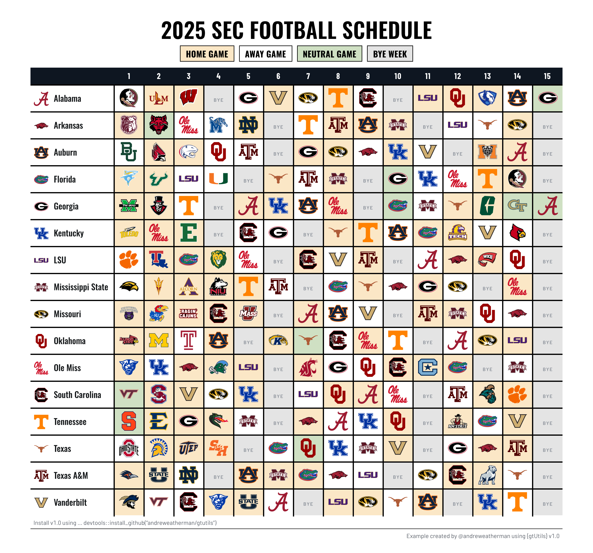

# Building a Schedule Matrix

The catch with a schedule matrix is the coloring. You want a cell shaded
by whether that game is home, away, or on a neutral field, and a
different shade for a bye. That is a decision made cell by cell, not
column by column, and it is where a schedule matrix gets awkward to
build.

The [old
approach](https://www.bucketsandbytes.com/p/team-schedule-matrices) was
to hand-write CSS: loop over row and column indices, build an
`nth-child` selector for every cell that should be shaded, and inject
the lot through
[`opt_css()`](https://gt.rstudio.com/reference/opt_css.html). It works,
but it is a lot of machinery for what is really one condition applied to
a grid of cells.

`v1.0` adds
[`gt_highlight_cells()`](https://andreweatherman.github.io/gtUtils/reference/gt_highlight_cells.md),
which fills individual cells by a condition, and
[`gt_legend_discrete()`](https://andreweatherman.github.io/gtUtils/reference/gt_legend_discrete.md),
which draws the matching key. This vignette builds a full SEC schedule
matrix with both, and picks up a few other `v1.0` habits along the way.

## The data

We pull the 2025 FBS schedule from
[`cfbfastR-data`](https://github.com/sportsdataverse/cfbfastR-data),
double it into one row per team with `nflreadr::clean_homeaway()`, and
keep the SEC. `clean_homeaway()` renames the `home_*` / `away_*` pairs
to `team_*` / `opponent_*` based on where each team played, so the same
`team_id` we use for the opponent’s logo also gives us each team’s own
logo.

``` r

base <- "http://a.espncdn.com/i/teamlogos/ncaa/500/"

data <- read_csv("https://github.com/sportsdataverse/cfbfastR-data/raw/refs/heads/main/schedules/csv/cfb_schedules_2025.csv") %>%
  filter(season_type == "regular") %>%
  select(home_team, away_team, week, home_conference, away_conference,
         home_id, away_id, neutral_site) %>%
  nflreadr::clean_homeaway() %>%
  filter(team_conference == "SEC") %>%
  mutate(opponent_logo = paste0(base, opponent_id, ".png"),
         team_logo = paste0(base, team_id, ".png"),
         location = ifelse(neutral_site == TRUE, "neutral", location)) %>%
  select(team, team_logo, week, location, opponent_logo)
```

`clean_homeaway()` sets `location` to `"home"` or `"away"`, so we fold
the schedule’s `neutral_site` flag into that same column as a third
value.

``` r

logos <- data %>%
  arrange(team) %>%
  pivot_wider(id_cols = c(team, team_logo), names_from = week,
              values_from = opponent_logo, names_sort = TRUE)

wk <- setdiff(names(logos), c("team", "team_logo"))
```

`names_sort = TRUE` sorts the week columns. Because `week` is numeric,
they come out `1` through `15` in order rather than `1, 10, 11, ...`.
Carrying `team_logo` through `id_cols` keeps each team’s logo alongside
its row without a second join.

## Carrying the location as a parallel mask

`pivot_wider()` on the opponent logo loses the location. But we can
pivot it into its own frame of the same shape and turn each state into a
logical mask.

``` r

locs <- data %>% pivot_wider(id_cols = team, names_from = week, values_from = location)
locs <- locs[match(logos$team, locs$team), ]

home_mask <- as.data.frame(locs[, wk] == "home")
away_mask <- as.data.frame(locs[, wk] == "away")
neutral_mask <- as.data.frame(locs[, wk] == "neutral")
```

The [`match()`](https://rdrr.io/r/base/match.html) line reorders `locs`
to follow `logos`, so both frames share a row order after the
`arrange()`. Each mask is then a `TRUE`/`FALSE` grid the same shape as
the week columns, which is what
[`gt_highlight_cells()`](https://andreweatherman.github.io/gtUtils/reference/gt_highlight_cells.md)
takes.

## Filling cells by condition

[`gt_highlight_cells()`](https://andreweatherman.github.io/gtUtils/reference/gt_highlight_cells.md)
fills the cells in a block of columns that meet a condition. The
condition is either a formula tested against each column, like
`~ is.na(.x)`, or a logical matrix the same shape as the columns, which
is what our masks are. It is the per-cell counterpart to
[`gtExtras::gt_highlight_cols()`](https://jthomasmock.github.io/gtExtras/reference/gt_highlight_cols.html)
and `gt_highlight_rows()`, which fill whole columns or rows.

``` r

gt_highlight_cells(all_of(wk), condition = home_mask, fill = "#FBE7C6") %>%
gt_highlight_cells(all_of(wk), condition = away_mask, fill = "#FFFFFF") %>%
gt_highlight_cells(all_of(wk), neutral_mask, fill = "#CFE0C3") %>%
gt_highlight_cells(all_of(wk), condition = ~ is.na(.x), fill = "#E4E4E4")
```

Home, away, and neutral come from the masks. The bye is any cell with no
game, which is a missing opponent, so `~ is.na(.x)` catches it without a
mask of its own.

[`gt_highlight_cells()`](https://andreweatherman.github.io/gtUtils/reference/gt_highlight_cells.md)
has more arguments (`text_color`, `bold`, and `...` to
[`cell_text()`](https://gt.rstudio.com/reference/cell_text.html)) for
when you want to style the text as well as the fill.

## Drawing the logos

With the cells shaded, we render the opponent URLs as images with
[`gtExtras::gt_img_rows()`](https://jthomasmock.github.io/gtExtras/reference/gt_img_rows.html),
one week column at a time.

``` r

purrr::reduce(wk, .init = ., .f = ~ rlang::inject(
  gtExtras::gt_img_rows(.x, columns = !!rlang::sym(.y), height = 35)
))
```

`gt_img_rows()` takes a single column, and it reads a quoted number like
`"1"` as a position rather than a name, so
[`all_of()`](https://tidyselect.r-lib.org/reference/all_of.html) fails
on our numeric week columns. `reduce()` threads the table through one
call per week, and `!!rlang::sym(.y)` hands each column in as a bare
name, which is the form `gt_img_rows()` wants. Keeping this inside the
pipe means no stored intermediate.

## Marking the byes

After the images render, we drop a muted `BYE` into the empty cells.

``` r

byemark <- "<span style=\"color:#8A9099;font-size:8px;font-weight:600;letter-spacing:0.12em\">BYE</span>"

reduce(wk, .init = ., .f = function(g, c) {
  b <- which(is.na(logos[[c]])); if (!length(b)) return(g)
  text_transform(g, cells_body(columns = all_of(c), rows = b), fn = function(x) byemark)
})
```

This has to run after `gt_img_rows()`, not through
[`sub_missing()`](https://gt.rstudio.com/reference/sub_missing.html),
because `gt_img_rows()` would otherwise wrap the placeholder text in a
broken `` tag. We find the missing rows per column and write the
mark straight into them.

## Logo and name in the team column

We can render the team logo and name together in a flex container and
pin the column width so a long name wraps instead of stretching the
table.

``` r

team_cell <- function(name, logo) sprintf(
  '<div style="display:flex; align-items:center; gap:8px;">
     
     <span style="font-family:\'Oswald\',sans-serif; font-size:14px; font-weight:500;
                  line-height:1.05;">%s</span></div>',
  logo, name)

text_transform(cells_body(columns = team),
               fn = \(x) unname(mapply(team_cell, logos$team, logos$team_logo)))
```

`flex:none` holds the logo at 26px so the name takes the rest of a fixed
column. We map from `logos$team` and `logos$team_logo` rather than the
`x` the transform receives, because `gt` HTML-escapes the cell first,
turning, e.g., “Texas A&M” into “Texas A&M”.

## The legend

[`gt_legend_discrete()`](https://andreweatherman.github.io/gtUtils/reference/gt_legend_discrete.md)
draws the key, the categorical partner to
[`gt_legend_continuous()`](https://andreweatherman.github.io/gtUtils/reference/gt_legend_continuous.md).
Pass it a named vector of `label = color` and it renders the swatches,
using the same fills as the cells so the key matches the table.

``` r

gt_legend_discrete(
  c("Home Game" = "#FBE7C6", "Away Game" = "#FFFFFF",
    "Neutral Game" = "#CFE0C3", "Bye Week" = "#E4E4E4"),
  location = "top", label_placement = "inside", shape = "square",
  gap = 8, swatch_size = 20, border_width = 1.5, border_color = "black",
  heading = "2025 SEC Football Schedule",
  heading_style = list(font = "Oswald", size = 36, weight = 600,
                       transform = "uppercase", margin_bottom = -5),
  label_style = list(font = "Oswald", size = 14, margin_bottom = 6)
)
```

`label_placement = "inside"` prints each label on its swatch, and the
text color is chosen per-swatch for contrast. The `heading_style` and
`label_style` lists follow the same convention as
[`gt_grid()`](https://andreweatherman.github.io/gtUtils/reference/gt_grid.md)
and
[`gt_title_header()`](https://andreweatherman.github.io/gtUtils/reference/gt_title_header.md):
`font`, `size`, `color`, `weight`, `italic`, `spacing`, `transform`, and
`align`, plus `line_height` and the `margin_*` and `padding_*` keys.
`margin_bottom = -5` pulls the key up tight under the title.

## Putting it together

The whole pipeline, from the wide frame to the finished image:

``` r

gt(logos, id = "table") %>%
  gt_theme_scoreboard() %>%
  cols_hide(team_logo) %>%
  gt_highlight_cells(all_of(wk), condition = home_mask, fill = "#FBE7C6") %>%
  gt_highlight_cells(all_of(wk), condition = away_mask, fill = "#FFFFFF") %>%
  gt_highlight_cells(all_of(wk), neutral_mask, fill = "#CFE0C3") %>%
  gt_highlight_cells(all_of(wk), condition = ~ is.na(.x), fill = "#E4E4E4") %>%
  purrr::reduce(wk, .init = ., .f = ~ rlang::inject(
    gtExtras::gt_img_rows(.x, columns = !!rlang::sym(.y), height = 35)
  )) %>%
  reduce(wk, .init = ., .f = function(g, c) {
    b <- which(is.na(logos[[c]])); if (!length(b)) return(g)
    text_transform(g, cells_body(columns = all_of(c), rows = b), fn = function(x) byemark)
  }) %>%
  text_transform(cells_body(columns = team),
                 fn = \(x) unname(mapply(team_cell, logos$team, logos$team_logo))) %>%
  cols_align(columns = -team, "center") %>%
  gt_border_grid(weight = 2) %>%
  tab_options(table_body.hlines.width = px(2)) %>%
  cols_width(-team ~ px(50), team ~ px(140)) %>%
  cols_label(team = "") %>%
  tab_style(locations = cells_column_labels(), cell_text(size = px(14))) %>%
  gt_legend_discrete(
    c("Home Game" = "#FBE7C6", "Away Game" = "#FFFFFF",
      "Neutral Game" = "#CFE0C3", "Bye Week" = "#E4E4E4"),
    location = "top", label_placement = "inside", shape = "square",
    gap = 8, swatch_size = 20, border_width = 1.5, border_color = "black",
    heading = "2025 SEC Football Schedule",
    heading_style = list(font = "Oswald", size = 36, weight = 600,
                         transform = "uppercase", margin_bottom = -5),
    label_style = list(font = "Oswald", size = 14, margin_bottom = 6)) %>%
  gt_538_caption(
    md('Install v1.0 using ... devtools::install_github("andreweatherman/gtutils")'),
    "Example created by @andreweatherman using {gtUtils} v1.0")
```


