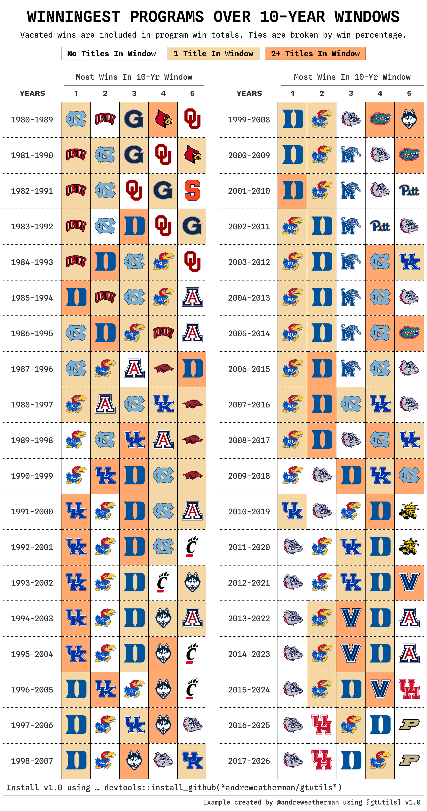

# Winningest Programs in Rolling Windows

Every ten-year window since 1980 gives you 38 rows, and each row holds a
year range and five logos. That is a table six columns wide and 38 rows
tall, which exports as a narrow strip with a lot of empty space on
either side.

There are two ways to fold something like that.
[`gt_grid()`](https://andreweatherman.github.io/gtUtils/reference/gt_grid.md)
builds each half as its own table and arranges them, which the [grid
tables](https://gtutils.aweatherman.com/articles/grid_tables.html)
vignette covers.
[`gt_snake()`](https://andreweatherman.github.io/gtUtils/reference/gt_snake.md)
goes the other way and keeps one table, cutting the rows into
side-by-side blocks that repeat the column labels. Because it stays a
single table, everything you have already applied to the cells comes
with it.

That last part is why this example works the way it does. The shading
here is per-cell, driven by how many national titles a program won
inside each window, and it is far easier to reason about on the plain
38-row grid than on the folded one. So we color first and fold second.
Along the way this vignette uses
[`gt_highlight_cells()`](https://andreweatherman.github.io/gtUtils/reference/gt_highlight_cells.md),
[`gt_legend_discrete()`](https://andreweatherman.github.io/gtUtils/reference/gt_legend_discrete.md),
and
[`gt_538_caption()`](https://andreweatherman.github.io/gtUtils/reference/gt_538_caption.md),
and spends some time on the scraping, since that is where most of the
actual work lives.

## Scraping the season records

Sports Reference publishes one ratings page per season, so we ask for 47
of them and stack the results.

``` r

library(rvest)
library(janitor)
library(glue)

season_results <- map_dfr(1980:2026, function(year) {
  Sys.sleep(3) # sports reference rate limits

  suppressWarnings(
    read_html(glue("https://www.sports-reference.com/cbb/seasons/men/{year}-ratings.html")) %>%
      html_nodes("#ratings") %>%
      html_table() %>%
      pluck(1) %>%
      row_to_names(1) %>%
      clean_names() %>%
      mutate(year = year, across(w:l, as.numeric)) %>%
      filter(!is.na(w)) %>%
      select(team = school, wins = w, losses = l, year)
  )
}, .progress = "Getting data")
```

Three things in there are worth pulling out.

The `Sys.sleep(3)` is not optional. Sports Reference starts returning a
501 if you hit it in a tight loop, and since that comes back as a
response rather than a thrown error, a run can look like it worked while
quietly dropping seasons. Three seconds is enough to stay under the
limit for a job this size.

These tables carry a spanner row above the real header, so
`html_table()` reads the spanner as the column names and leaves the true
header sitting in row one (`row_to_names(1)`). Promoting row one fixes
it, and `clean_names()` then turns `W` and `L` into names you can use
without backticks.

The `filter(!is.na(w))` clears the repeated header rows that Sports
Reference leaves every twenty teams or so. Those survive the parse as
rows where the numeric columns hold text, so coercing with
[`as.numeric()`](https://rdrr.io/r/base/numeric.html) first turns them
into `NA` and the filter takes them out.

## Rolling windows

A rolling window is a filter and a sum. This function takes a start
year, keeps the ten seasons from there, and totals each team’s record.

``` r

calculate_windows <- function(start_year, data) {
  data %>%
    filter(between(year, start_year, start_year + 9)) %>%
    summarize(
      total_wins = sum(wins),
      total_losses = sum(losses),
      win_percentage = total_wins / (total_wins + total_losses),
      seasons = n(),
      .by = team
    ) %>%
    mutate(years = paste(start_year, start_year + 9, sep = "-"), begin = start_year)
}

plot_data <- map_dfr(1980:2017, calculate_windows, season_results) %>%
  arrange(begin, desc(total_wins), desc(win_percentage)) %>%
  mutate(position = row_number(), .by = begin) %>%
  slice_head(n = 5, by = years)
```

Mapping it over the start years gives every window at once. Ranking
happens inside each window with `row_number()` after the `arrange()`,
and win percentage breaks ties on total wins.

The start years stop at 2017 while the seasons run through 2026 (a
window starting in 2018 does not have ten seasons in it yet).

## Counting titles

The shading comes from national titles won inside each window, which
means a second scrape and the same windowing logic.

``` r

champs <- read_html("https://www.sports-reference.com/cbb/seasons/") %>%
  html_nodes("#seasons_NCAAM") %>%
  html_table() %>%
  pluck(1) %>%
  clean_names() %>%
  mutate(year = parse_number(tournament)) %>%
  select(year, team = ncaa_champion) %>%
  filter(year >= 1954 & year != 2020)

calculate_titles <- function(start_year, data) {
  data %>%
    filter(between(year, start_year, start_year + 9)) %>%
    summarize(total_titles = n(), .by = team) %>%
    mutate(years = paste(start_year, start_year + 9, sep = "-"))
}

champs <- map_dfr(1980:2024, function(y) calculate_titles(y, champs)) %>%
  mutate(total_titles = ifelse(total_titles == 1, "1", "2+")) %>%
  select(team, total_titles, years)

plot_data <- plot_data %>%
  left_join(champs, by = c("team", "years")) %>%
  mutate(total_titles = replace_na(total_titles, "0"))
```

The `year != 2020` filter is there because the 2020 tournament was
cancelled. That row still exists on the page with an empty champion, and
left in, it counts a title for a team named `""`.

Bucketing into `"0"`, `"1"`, and `"2+"` keeps the key short. The
`replace_na()` at the end matters because the join only produces rows
for teams that won something, which leaves every other team-window as
`NA`.

## The pivot, and keeping the mask aligned

We want one row per window and five logo columns in rank order. Logos
come from `cbbdata` as a named vector, so we can look them up by team
name.

``` r

library(cbbdata)

logos <- cbd_teams() %>% select(team = sr_team, logo)
logos <- logos %>% pull(logo) %>% rlang::set_names(logos$team)
```

`pivot_wider()` spreads one value column, so pivoting on the logo gives
you logos and nothing else. The title count lives in `total_titles`, and
it would be gone by the time we draw the table.

The way around it is to pivot twice from the same ordered frame, once
for what you draw (years and teams) and once for what you style by
(titles).

``` r

ordered <- plot_data %>%
  mutate(logo = unname(logos[team])) %>%
  arrange(begin, position)

# years + five teams
wide <- ordered %>%
  pivot_wider(id_cols = years, names_from = position, values_from = logo, names_sort = TRUE)

# the shading key
titles <- ordered %>%
  pivot_wider(id_cols = years, names_from = position, values_from = total_titles, names_sort = TRUE) %>%
  select(-years)
```

Sorting once, before either pivot, is what keeps the two frames in step.
Both inherit the same row order and the same column order, so cell
`[3, 2]` in `titles` describes cell `[3, 2]` in `wide` with no matching
or joining afterward.

Each shading condition is then one comparison over the whole frame,
which gives a `TRUE`/`FALSE` grid the same shape as the logo columns.
`"0"` is the base state, so it needs no mask of its own.

``` r

mask_1 <- titles == "1"
mask_2 <- titles == "2+"

pos <- setdiff(names(wide), "years")
```

## Color first, then snake

[`gt_highlight_cells()`](https://andreweatherman.github.io/gtUtils/reference/gt_highlight_cells.md)
fills individual cells from a logical grid of the same shape, which is
what the masks are. We run it on the plain, un-snaked table.

``` r

wide %>%
  gt(id = "table") %>%
  gt_highlight_cells(-years, condition = mask_1, fill = "#F4D7A4") %>%
  gt_highlight_cells(-years, condition = mask_2, fill = "#FFA970") %>%
  gt_snake(n_cols = 2) %>%
  gt_theme_athletic()
```

[`gt_snake()`](https://andreweatherman.github.io/gtUtils/reference/gt_snake.md)
rebuilds the table with the rows cut into two blocks side by side, and
it moves any body-cell styling to wherever that cell ended up. A fill on
row 20 of the long grid lands on row one of the second block, because it
is the same cell.

Ordering is the thing to remember here. Styles carry through the reshape
but formatting and content transforms do not, so anything from the
`fmt_*()` family,
[`text_transform()`](https://gt.rstudio.com/reference/text_transform.html),
or `gt_img_rows()` has to come after the snake. Themes go after as well.

For a parallel frame you cannot apply before folding,
[`gt_snake_align()`](https://andreweatherman.github.io/gtUtils/reference/gt_snake_align.md)
reshapes it into the same blocks so it still lines up.

[`gt_snake()`](https://andreweatherman.github.io/gtUtils/reference/gt_snake.md)
puts a real empty column between the blocks rather than padding the
seam, because padding shifts the body cells without shifting the column
label and the two stop lining up. That spacer would otherwise pick up
rules from a theme or from
[`gt_border_grid()`](https://andreweatherman.github.io/gtUtils/reference/gt_border_grid.md),
so `clean_gaps = TRUE`, the default, strips its borders and background
and keeps the gap blank.

## Drawing the logos

With the cells shaded, we render the URLs as images. After the fold,
each column carries its block number as a suffix, running `1_1` through
`5_2`.

``` r

logo_cols <- unlist(lapply(1:2, function(i) paste0(pos, "_", i)))

# ... %>%
  reduce(logo_cols, .init = ., .f = ~ rlang::inject(
    gtExtras::gt_img_rows(.x, columns = !!rlang::sym(.y), height = 35)
  ))
```

`gt_img_rows()` takes one column at a time, and it reads a quoted string
like `"1_1"` as a position rather than a name. `reduce()` threads the
table through one call per column, and `!!rlang::sym(.y)` hands each one
over as a bare name, which is the form it wants. Keeping this inside the
pipe avoids a stored intermediate.

## Spanners, widths, and rules

The rest is ordinary `gt`. Each block gets a spanner, the year column
gets a label and a fixed width, and a dotted rule separates the logos.

``` r

# ... %>%
  cols_align(columns = everything(), "center") %>%
  tab_spanner(columns = matches("[0-9]_1"), label = "Most Wins In 10-Yr Window", id = 1) %>%
  tab_spanner(columns = matches("[0-9]_2"), label = "Most Wins In 10-Yr Window", id = 2) %>%
  cols_label(starts_with("years") ~ "Years") %>%
  cols_width(
    starts_with("years") ~ px(90),
    -c(starts_with("years"), contains("gap")) ~ px(45)
  ) %>%
  tab_options(table_body.hlines.style = "solid", table_body.hlines.color = "black") %>%
  tab_style(
    locations = cells_body(columns = 1:12),
    style = cell_borders(color = "black", sides = "right", weight = px(1.5), style = "dotted")
  )
```

`matches("[0-9]_1")` and `contains("gap")` pick the snaked columns out
by their naming pattern instead of listing twelve names by hand, which
also means the code survives a change to `n_cols`.

The dotted rule is set to `px(1.5)` because
[`gt_theme_athletic()`](https://andreweatherman.github.io/gtUtils/reference/gt_theme_athletic.md)
already draws a thin solid separator on every column. Anything lighter
won’t be applied!

## The legend and the caption

[`gt_legend_discrete()`](https://andreweatherman.github.io/gtUtils/reference/gt_legend_discrete.md)
takes a named vector of `label = color` and draws the key.

``` r

# ... %>%
  gt_legend_discrete(
    c("No Titles In Window" = "#ffffff", "1 Title In Window" = "#F4D7A4",
      "2+ Titles In Window" = "#FFA970"),
    location = "top", label_placement = "inside", shape = "square",
    gap = 8, swatch_size = 20, border_width = 1.5, border_color = "black",
    heading = md("Winningest programs over 10-year windows"),
    subtitle = md("Vacated wins are included. Ties are broken by win percentage."),
    heading_style = list(font = "Spline Sans Mono", size = 24, weight = 600,
                         transform = "uppercase", margin_bottom = 0, align = "center"),
    subtitle_style = list(font = "Spline Sans Mono", size = 12, margin_bottom = 5,
                          align = "center", color = "black"),
    label_style = list(font = "Spline Sans Mono", size = 12, margin_bottom = 12)
  ) %>%
  gt_538_caption(
    md('Install v1.0 using ... devtools::install_github("andreweatherman/gtutils")'),
    "Example created by @andreweatherman using {gtUtils} v1.0"
  )
```

`label_placement = "inside"` prints each label on its own swatch and
picks the text color per swatch for contrast, which is how the white
swatch stays readable. The `heading_style`, `subtitle_style`, and
`label_style` lists follow the same convention as
[`gt_grid()`](https://andreweatherman.github.io/gtUtils/reference/gt_grid.md)
and
[`gt_title_header()`](https://andreweatherman.github.io/gtUtils/reference/gt_title_header.md).

[`gt_538_caption()`](https://andreweatherman.github.io/gtUtils/reference/gt_538_caption.md)
takes the top line, which gets the rule under it, and the bottom line,
which becomes the source note. Apply it after the theme, since it reads
the rendered table to borrow a rule color that matches.

## Putting it together

The whole pipeline, from the wide frame to the finished image:

``` r

wide %>%
  gt(id = "table") %>%
  gt_highlight_cells(-years, condition = mask_1, fill = "#F4D7A4") %>%
  gt_highlight_cells(-years, condition = mask_2, fill = "#FFA970") %>%
  gt_snake(n_cols = 2) %>%
  gt_theme_athletic() %>%
  reduce(logo_cols, .init = ., .f = ~ rlang::inject(
    gtExtras::gt_img_rows(.x, columns = !!rlang::sym(.y), height = 35)
  )) %>%
  cols_align(columns = everything(), "center") %>%
  tab_spanner(columns = matches("[0-9]_1"), label = "Most Wins In 10-Yr Window", id = 1) %>%
  tab_spanner(columns = matches("[0-9]_2"), label = "Most Wins In 10-Yr Window", id = 2) %>%
  cols_label(starts_with("years") ~ "Years") %>%
  cols_width(
    starts_with("years") ~ px(90),
    -c(starts_with("years"), contains("gap")) ~ px(45)
  ) %>%
  tab_options(table_body.hlines.style = "solid", table_body.hlines.color = "black") %>%
  tab_style(
    locations = cells_body(columns = 1:12),
    style = cell_borders(color = "black", sides = "right", weight = px(1.5), style = "dotted")
  ) %>%
  gt_legend_discrete(
    c("No Titles In Window" = "#ffffff", "1 Title In Window" = "#F4D7A4",
      "2+ Titles In Window" = "#FFA970"),
    location = "top", label_placement = "inside", shape = "square",
    gap = 8, swatch_size = 20, border_width = 1.5, border_color = "black",
    heading = md("Winningest programs over 10-year windows"),
    subtitle = md("Vacated wins are included. Ties are broken by win percentage."),
    heading_style = list(font = "Spline Sans Mono", size = 24, weight = 600,
                         transform = "uppercase", margin_bottom = 0, align = "center"),
    subtitle_style = list(font = "Spline Sans Mono", size = 12, margin_bottom = 5,
                          align = "center", color = "black"),
    label_style = list(font = "Spline Sans Mono", size = 12, margin_bottom = 12)
  ) %>%
  gt_538_caption(
    md('Install v1.0 using ... devtools::install_github("andreweatherman/gtutils")'),
    "Example created by @andreweatherman using {gtUtils} v1.0"
  )
```


