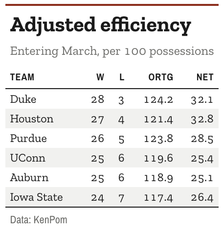

# Record-book theme for `gt` tables

The look of a printed statistical abstract. A slab body, narrow
condensed labels, tight rows, and row banding to walk the eye across a
wide table.

## Usage

``` r
gt_theme_almanac(
  gt_object,
  accent = "#8C2F1E",
  density = c("compact", "comfortable", "social"),
  stripe = "#F1F1EF",
  ...
)
```

## Arguments

- gt_object:

  A `gt` table object to modify.

- accent:

  Character. A hex color for the row-group labels and the rule above the
  table. Defaults to `"#8C2F1E"`.

- density:

  Character. The type and padding scale. One of `"comfortable"`,
  `"compact"`, or `"social"`. See Density. Defaults to `"compact"`.

- stripe:

  Character. A hex color for the banded rows. Pass `NA` to switch
  banding off and keep the rest of the theme. Defaults to `"#F1F1EF"`.

- ...:

  Additional arguments passed to
  [`gt::tab_options`](https://gt.rstudio.com/reference/tab_options.html),
  applied last so they override anything the theme sets.

## Value

Returns a modified `gt` table with the theme applied.

## Details

It is the only theme in the package that bands its rows.

## Density

`density` sets the type and padding scale together. `"comfortable"` uses
a 14px body with roomy rows, `"compact"` a 12px body with tight rows,
and `"social"` a 17px body with generous rows and a larger title, at the
scale
[`gt_save_crop()`](https://andreweatherman.github.io/gtUtils/reference/gt_save_crop.md)
and
[`gt_social_crop()`](https://andreweatherman.github.io/gtUtils/reference/gt_social_crop.md)
export at.

## Figures



## Examples

``` r
if (FALSE) { # \dontrun{
library(gt)
gt(head(mtcars, 12)) %>% gt_theme_almanac()

# banding off, cooler accent
gt(head(airquality, 15)) %>% gt_theme_almanac(stripe = NA, accent = "#1F3A5F")
} # }
```
