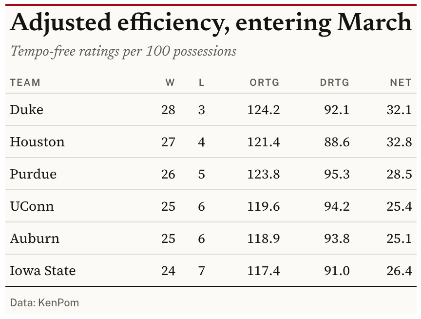

# Editorial serif theme for `gt` tables

Sets a serif body under small letterspaced sans column labels, with
hairline rules and no fills anywhere. Row groups are an uppercase label
over a rule rather than a colored band.

## Usage

``` r
gt_theme_broadsheet(
  gt_object,
  accent = "#A6081A",
  density = c("comfortable", "compact", "social"),
  paper = "white",
  ...
)
```

## Arguments

- gt_object:

  A `gt` table object to modify.

- accent:

  Character. A hex color for the rule above the table and for the
  row-group labels. Defaults to `"#A6081A"`.

- density:

  Character. The type and padding scale. One of `"comfortable"`,
  `"compact"`, or `"social"`. See Density. Defaults to `"comfortable"`.

- paper:

  Character. The table background. Either `"white"` for a warm
  off-white, `"salmon"` for the financial-press pink, or any hex color,
  in which case the hairline color is left neutral. Defaults to
  `"white"`.

- ...:

  Additional arguments passed to
  [`gt::tab_options`](https://gt.rstudio.com/reference/tab_options.html),
  applied last so they override anything the theme sets.

## Value

Returns a modified `gt` table with the theme applied.

## Details

`accent` recolors the rule above the table and the row-group labels.

## Density

`density` sets the type and padding scale together. `"comfortable"` uses
a 14px body with roomy rows, `"compact"` a 12px body with tight rows,
and `"social"` a 17px body with generous rows and a larger title, at the
scale
[`gt_save_crop()`](https://andreweatherman.github.io/gtUtils/reference/gt_save_crop.md)
and
[`gt_social_crop()`](https://andreweatherman.github.io/gtUtils/reference/gt_social_crop.md)
export at.

## Figures



## See also

[`gt_title_header()`](https://andreweatherman.github.io/gtUtils/reference/gt_title_header.md)
for a richer header block, and
[`gt_legend_continuous()`](https://andreweatherman.github.io/gtUtils/reference/gt_legend_continuous.md)
for explaining a colored column.

## Examples

``` r
if (FALSE) { # \dontrun{
library(gt)

gt(head(mtcars[c("mpg", "hp", "wt")], 8)) %>% gt_theme_broadsheet()

# financial-press pink, sized for an image export
gt(head(airquality, 8)) %>%
  gt_theme_broadsheet(paper = "salmon", accent = "#0F5257", density = "social")
} # }
```
