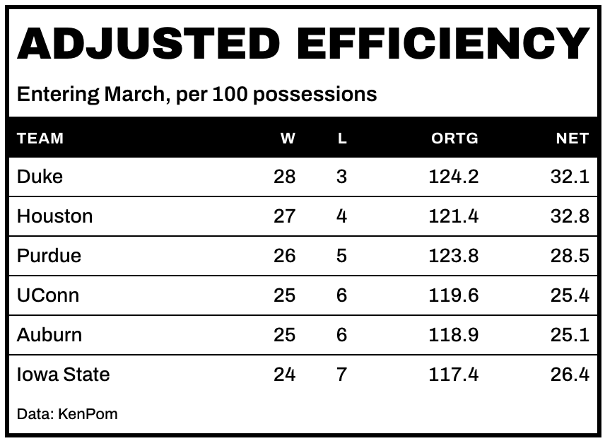

# Heavy-rule display theme for `gt` tables

Heavy black rules, a solid label bar, and a display face at a large
size.

## Usage

``` r
gt_theme_brutalist(
  gt_object,
  accent = "#FF3B00",
  density = c("comfortable", "compact", "social"),
  ...
)
```

## Arguments

- gt_object:

  A `gt` table object to modify.

- accent:

  Character. The theme's single accent color, used on the row-group
  labels. Defaults to `"#FF3B00"`.

- density:

  Character. The type and padding scale. One of `"comfortable"`,
  `"compact"`, or `"social"`. See Density. Defaults to `"comfortable"`.

- ...:

  Additional arguments passed to
  [`gt::tab_options`](https://gt.rstudio.com/reference/tab_options.html),
  applied last so they override anything the theme sets.

## Value

Returns a modified `gt` table with the theme applied.

## Details

The accent color is used in exactly one place, on the row-group labels.

## Density

`density` sets the type and padding scale together. `"comfortable"` uses
a 14px body with roomy rows, `"compact"` a 12px body with tight rows,
and `"social"` a 17px body with generous rows and a larger title, at the
scale
[`gt_save_crop()`](https://andreweatherman.github.io/gtUtils/reference/gt_save_crop.md)
and
[`gt_social_crop()`](https://andreweatherman.github.io/gtUtils/reference/gt_social_crop.md)
export at.

## Figures



## Examples

``` r
if (FALSE) { # \dontrun{
library(gt)
gt(head(mtcars)) %>% gt_theme_brutalist()
gt(head(mtcars)) %>% gt_theme_brutalist(accent = "#0033FF", density = "social")
} # }
```
