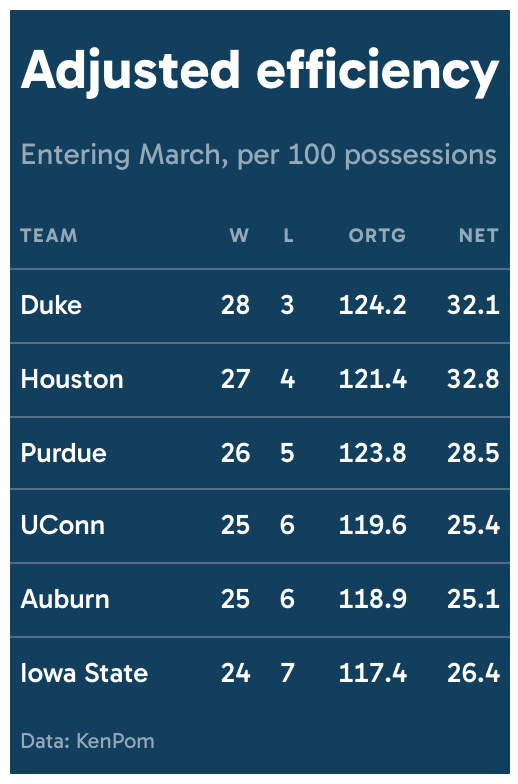

# Saturated single-color theme for `gt` tables

Colors the entire table surface instead of putting a colored detail on a
neutral background, tying the table to a single brand or publication
color.

## Usage

``` r
gt_theme_drench(
  gt_object,
  color = "#123F5E",
  density = c("comfortable", "compact", "social"),
  ...
)
```

## Arguments

- gt_object:

  A `gt` table object to modify.

- color:

  Character. The hex color the table is drenched in. Anything from a
  near-black to a mid-saturation brand color works, and very pale colors
  flip the type to dark automatically. Defaults to `"#123F5E"`.

- density:

  Character. The type and padding scale. One of `"comfortable"`,
  `"compact"`, or `"social"`. See Density. Defaults to `"comfortable"`.

- ...:

  Additional arguments passed to
  [`gt::tab_options`](https://gt.rstudio.com/reference/tab_options.html),
  applied last so they override anything the theme sets.

## Value

Returns a modified `gt` table with the theme applied.

## Details

Text, rules, and secondary type are all derived from `color`. The type
color is whichever of black or white measures higher contrast against
the background, and the rules are built by shifting the background
itself, since gray laid over a saturated ground looks washed out.

## Legibility

The secondary color used for column labels, the subtitle and source
notes is blended toward the type color until it clears a 4.5:1 contrast
ratio against the background, so it stays readable whatever `color` you
pass.

## Density

`density` sets the type and padding scale together. `"comfortable"` uses
a 14px body with roomy rows, `"compact"` a 12px body with tight rows,
and `"social"` a 17px body with generous rows and a larger title, at the
scale
[`gt_save_crop()`](https://andreweatherman.github.io/gtUtils/reference/gt_save_crop.md)
and
[`gt_social_crop()`](https://andreweatherman.github.io/gtUtils/reference/gt_social_crop.md)
export at.

## Figures



## See also

[`gt_theme_midnight()`](https://andreweatherman.github.io/gtUtils/reference/gt_theme_midnight.md)
for a restrained dark background instead.

## Examples

``` r
if (FALSE) { # \dontrun{
library(gt)
gt(head(mtcars)) %>% gt_theme_drench()

# a brand color, with a matching export canvas
gt(head(mtcars)) %>%
  gt_theme_drench(color = "#4B1E78", density = "social") %>%
  gt_social_crop(bg = "#4B1E78")
} # }
```
