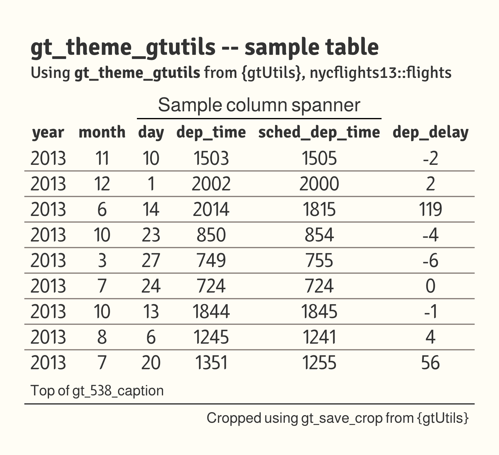

# gtUtils theme for `gt` tables

The package's house theme. A warm cream background, an Almarai body,
Signika Negative titles, column labels and row groups, hairline
separators between rows, and gray row-group bands carrying cream labels.
All columns are centered.

## Usage

``` r
gt_theme_gtutils(
  gt_object,
  density = c("comfortable", "compact", "social"),
  ...
)
```

## Arguments

- gt_object:

  A `gt` table object to modify.

- density:

  Character. The type and padding scale. One of `"comfortable"`,
  `"compact"`, or `"social"`. See Density. Defaults to `"comfortable"`.

- ...:

  Additional arguments passed to
  [`gt::tab_options`](https://gt.rstudio.com/reference/tab_options.html),
  applied last so they override anything the theme sets.

## Value

Returns a modified `gt` table with the theme applied.

## Details

The row separators are a single bottom border in gray (`#8A817C`)
applied to every body row except the last, so the table closes on the
background rather than a rule. The background is a warm cream
(`#FFFDF5`), and horizontal rules are otherwise set transparent. A table
id is resolved (or generated) up front so the
[`gt::opt_css()`](https://gt.rstudio.com/reference/opt_css.html) block
can pin the closing row border and heading padding to this table alone.
`density` rescales the finished table, since this theme sets its sizes
directly rather than deriving them from a scale.

## Density

`density` scales the theme's type and row padding together.
`"comfortable"` leaves every size as the theme sets it, `"compact"`
scales both down, and `"social"` scales both up, to the scale
[`gt_save_crop()`](https://andreweatherman.github.io/gtUtils/reference/gt_save_crop.md)
and
[`gt_social_crop()`](https://andreweatherman.github.io/gtUtils/reference/gt_social_crop.md)
export at.

## Figures



## Examples

``` r
if (FALSE) { # \dontrun{
library(gt)
gt(head(mtcars)) %>% gt_theme_gtutils()
gt(head(mtcars)) %>% gt_theme_gtutils(density = "compact")
} # }
```
