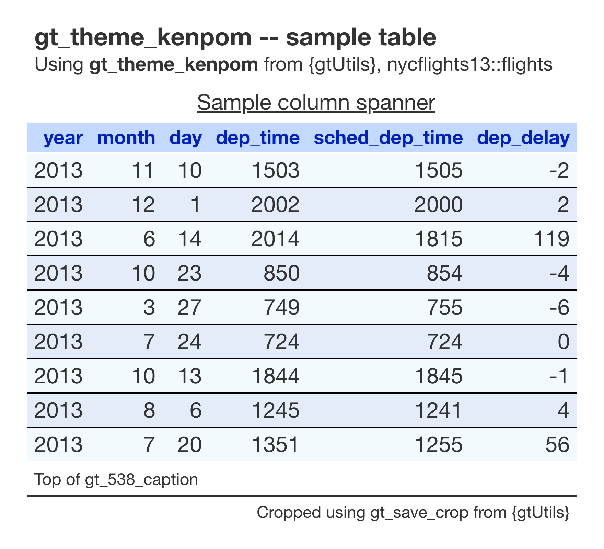

# KenPom theme for `gt` tables

Modeled on KenPom's tables. Helvetica Neue type, blue zebra-striped
rows, blue column labels and row-group bands set over a light-blue fill,
and underlined spanners. The heading is centered.

## Usage

``` r
gt_theme_kenpom(
  gt_object,
  density = c("comfortable", "compact", "social"),
  ...
)
```

## Arguments

- gt_object:

  A `gt` table object to modify.

- density:

  Character. The type and padding scale. One of `"comfortable"`,
  `"compact"`, or `"social"`. See Density. Defaults to `"comfortable"`.

- ...:

  Additional arguments passed to
  [`gt::tab_options`](https://gt.rstudio.com/reference/tab_options.html),
  applied last so they override anything the theme sets.

## Value

Returns a modified `gt` table with the theme applied.

## Details

The striping is applied by row position, a pale blue (`#F2FAFD`) on odd
rows and a slightly deeper blue (`#e5ecf9`) on even rows, so it follows
the order the data is in. A thin black bottom border separates every
body row except the last. To force the spanner row to render so it can
be underlined, the theme adds a placeholder spanner and then hides it
with `display: none` in the
[`gt::opt_css()`](https://gt.rstudio.com/reference/opt_css.html) block.
A table id is resolved (or generated) up front so that CSS binds to this
table alone. `density` rescales the finished table, since this theme
sets its sizes directly rather than deriving them from a scale.

## Density

`density` scales the theme's type and row padding together.
`"comfortable"` leaves every size as the theme sets it, `"compact"`
scales both down, and `"social"` scales both up, to the scale
[`gt_save_crop()`](https://andreweatherman.github.io/gtUtils/reference/gt_save_crop.md)
and
[`gt_social_crop()`](https://andreweatherman.github.io/gtUtils/reference/gt_social_crop.md)
export at.

## Figures



## Examples

``` r
if (FALSE) { # \dontrun{
library(gt)
gt(head(mtcars)) %>% gt_theme_kenpom()
gt(head(mtcars)) %>% gt_theme_kenpom(density = "compact")
} # }
```
