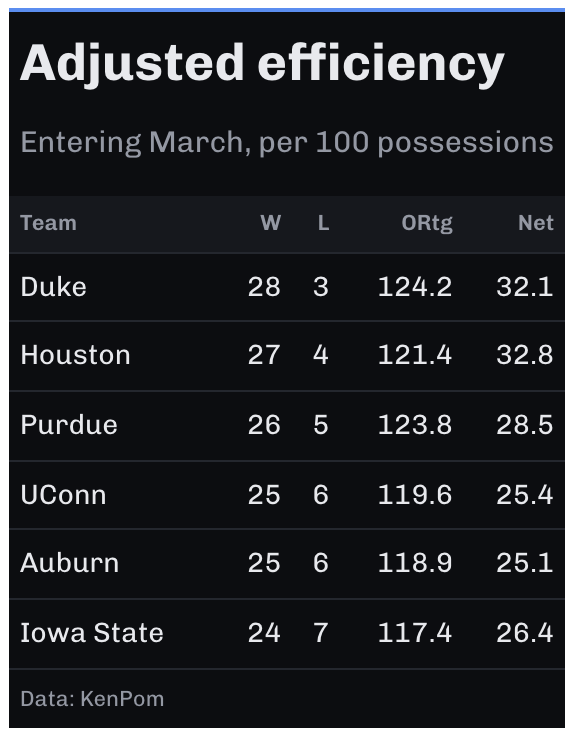

# Dark theme for `gt` tables

A restrained dark theme. The background is a near-black instead of pure
black, which avoids the smearing pure black causes on OLED screens.
Column labels sit on a slightly raised band, rules are hairlines, and
the body has no fills.

## Usage

``` r
gt_theme_midnight(
  gt_object,
  accent = "#5B8DEF",
  density = c("comfortable", "compact", "social"),
  ...
)
```

## Arguments

- gt_object:

  A `gt` table object to modify.

- accent:

  Character. A hex color for the row-group labels and the rule above the
  table. Defaults to `"#5B8DEF"`.

- density:

  Character. The type and padding scale. One of `"comfortable"`,
  `"compact"`, or `"social"`. See Density. Defaults to `"comfortable"`.

- ...:

  Additional arguments passed to
  [`gt::tab_options`](https://gt.rstudio.com/reference/tab_options.html),
  applied last so they override anything the theme sets.

## Value

Returns a modified `gt` table with the theme applied.

## Details

Light text on a dark background reads as lighter weight than it is, so
the theme opens up the line height to compensate.

## Color scales on dark grounds

A green-to-red ramp built for white paper goes muddy on a near-black
background, as its mid-tones collapse toward the background. Use
[pal_midnight](https://andreweatherman.github.io/gtUtils/reference/pal_midnight.md)
with
[`gt_color_ranks()`](https://andreweatherman.github.io/gtUtils/reference/gt_color_ranks.md)
instead.

## Density

`density` sets the type and padding scale together. `"comfortable"` uses
a 14px body with roomy rows, `"compact"` a 12px body with tight rows,
and `"social"` a 17px body with generous rows and a larger title, at the
scale
[`gt_save_crop()`](https://andreweatherman.github.io/gtUtils/reference/gt_save_crop.md)
and
[`gt_social_crop()`](https://andreweatherman.github.io/gtUtils/reference/gt_social_crop.md)
export at.

## Figures



## See also

[pal_midnight](https://andreweatherman.github.io/gtUtils/reference/pal_midnight.md)
for a color scale that survives a dark ground, and
[`gt_theme_terminal()`](https://andreweatherman.github.io/gtUtils/reference/gt_theme_terminal.md)
for a denser dark look.

## Examples

``` r
if (FALSE) { # \dontrun{
library(gt)
gt(head(mtcars)) %>% gt_theme_midnight()

# color scales need lifting on a dark ground; see pal_midnight
gt(head(airquality, 10)) %>%
  gt_theme_midnight() %>%
  gt_color_ranks(Temp, palette = pal_midnight)
} # }
```
