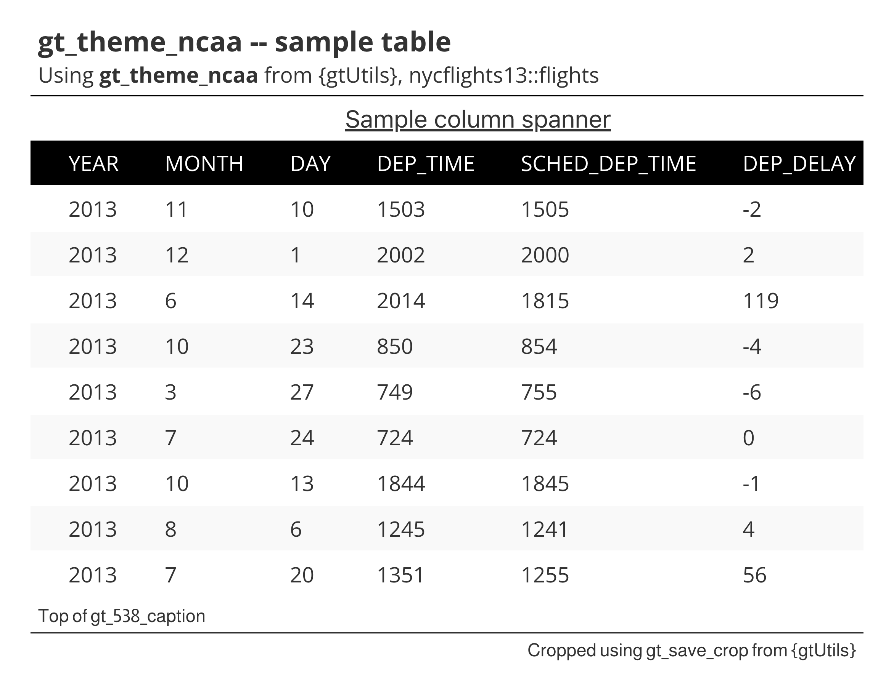

# NCAA theme for `gt` tables

Open Sans throughout, with uppercase white column labels on a solid
black band and zebra-striped rows, after the NCAA. Row groups render as
white labels on a dark gray fill, column spanners are underlined, and
every column is left aligned with a 25px left indent on each row.

## Usage

``` r
gt_theme_ncaa(gt_object, density = c("comfortable", "compact", "social"), ...)
```

## Arguments

- gt_object:

  A `gt` table object to modify.

- density:

  Character. The type and padding scale. One of `"comfortable"`,
  `"compact"`, or `"social"`. See Density. Defaults to `"comfortable"`.

- ...:

  Additional arguments passed to
  [`gt::tab_options`](https://gt.rstudio.com/reference/tab_options.html),
  applied last so they override anything the theme sets.

## Value

Returns a modified `gt` table with the theme applied.

## Details

Column labels sit in a solid black band in white uppercase Open Sans,
while source notes and footnotes switch to Almarai. Rows are
zebra-striped through
[`gt::opt_row_striping()`](https://gt.rstudio.com/reference/opt_row_striping.html),
horizontal rules are hidden, and each row and heading carries a 25px
left indent. The last body row's bottom border is painted white so it
does not double the rule that closes the table.

## Density

`density` scales the theme's type and row padding together.
`"comfortable"` leaves every size as the theme sets it, `"compact"`
scales both down, and `"social"` scales both up, to the scale
[`gt_save_crop()`](https://andreweatherman.github.io/gtUtils/reference/gt_save_crop.md)
and
[`gt_social_crop()`](https://andreweatherman.github.io/gtUtils/reference/gt_social_crop.md)
export at.

## Figures



## Examples

``` r
if (FALSE) { # \dontrun{
library(gt)
gt(head(mtcars)) %>% gt_theme_ncaa()
} # }
```
