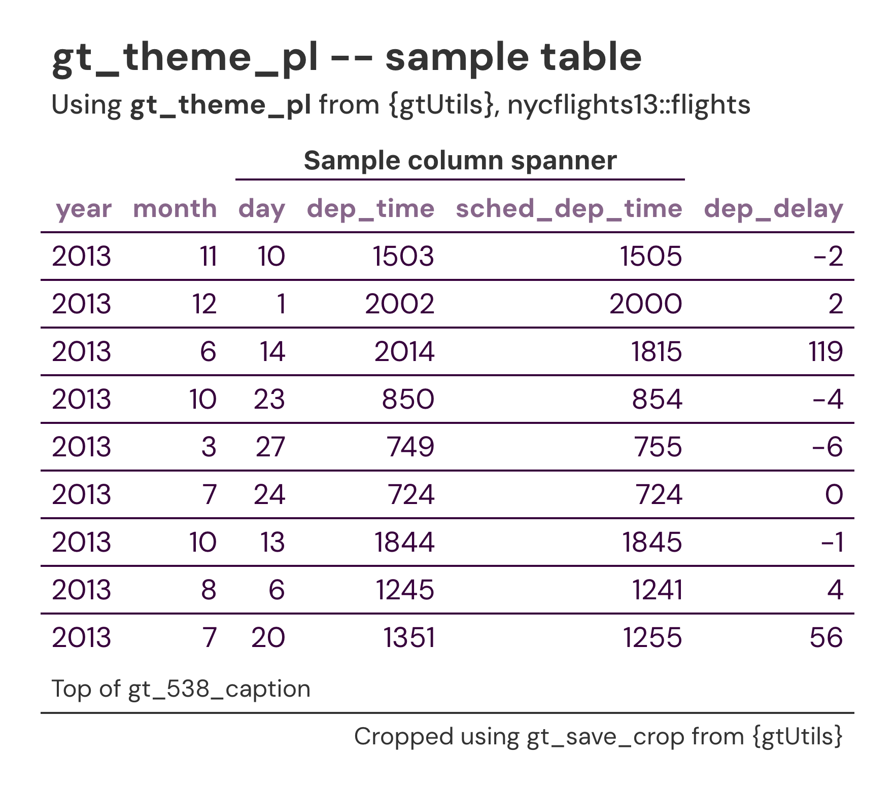

# Premier League theme for `gt` tables

DM Sans throughout in the Premier League's deep purple (`#37003c`), with
muted-purple column labels and a purple rule bracketing the body. Row
groups render as white labels on a pale lilac fill, and column spanners
are bold and underlined.

## Usage

``` r
gt_theme_pl(gt_object, density = c("comfortable", "compact", "social"), ...)
```

## Arguments

- gt_object:

  A `gt` table object to modify.

- density:

  Character. The type and padding scale. One of `"comfortable"`,
  `"compact"`, or `"social"`. See Density. Defaults to `"comfortable"`.

- ...:

  Additional arguments passed to
  [`gt::tab_options`](https://gt.rstudio.com/reference/tab_options.html),
  applied last so they override anything the theme sets.

## Value

Returns a modified `gt` table with the theme applied.

## Details

A purple rule closes the column labels and another opens the body, and
each body row is separated by a purple bottom border. The last body
row's bottom border is painted white so it does not double the rule that
closes the table.

## Density

`density` scales the theme's type and row padding together.
`"comfortable"` leaves every size as the theme sets it, `"compact"`
scales both down, and `"social"` scales both up, to the scale
[`gt_save_crop()`](https://andreweatherman.github.io/gtUtils/reference/gt_save_crop.md)
and
[`gt_social_crop()`](https://andreweatherman.github.io/gtUtils/reference/gt_social_crop.md)
export at.

## Figures



## Examples

``` r
if (FALSE) { # \dontrun{
library(gt)
gt(head(mtcars)) %>% gt_theme_pl()
} # }
```
