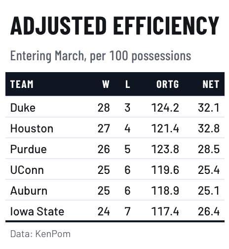

# Broadcast-graphics theme for `gt` tables

A solid color band carrying condensed uppercase labels, over tight rows,
after a television lower-third or a stadium scoreboard.

## Usage

``` r
gt_theme_scoreboard(
  gt_object,
  accent = "#0E1621",
  density = c("compact", "comfortable", "social"),
  ...
)
```

## Arguments

- gt_object:

  A `gt` table object to modify.

- accent:

  Character. A hex color for the header band. The label color adapts to
  it. Defaults to `"#0E1621"`.

- density:

  Character. The type and padding scale. One of `"comfortable"`,
  `"compact"`, or `"social"`. See Density. Defaults to `"compact"`.

- ...:

  Additional arguments passed to
  [`gt::tab_options`](https://gt.rstudio.com/reference/tab_options.html),
  applied last so they override anything the theme sets.

## Value

Returns a modified `gt` table with the theme applied.

## Details

`accent` sets the band itself, so one argument restyles the whole table
to a brand color. The label color is checked against the band and
flipped to dark if the accent is pale.

## Density

`density` sets the type and padding scale together. `"comfortable"` uses
a 14px body with roomy rows, `"compact"` a 12px body with tight rows,
and `"social"` a 17px body with generous rows and a larger title, at the
scale
[`gt_save_crop()`](https://andreweatherman.github.io/gtUtils/reference/gt_save_crop.md)
and
[`gt_social_crop()`](https://andreweatherman.github.io/gtUtils/reference/gt_social_crop.md)
export at.

## Figures



## See also

[`gt_spotlight()`](https://andreweatherman.github.io/gtUtils/reference/gt_spotlight.md)
for picking out a row, and
[`gt_fmt_rank()`](https://andreweatherman.github.io/gtUtils/reference/gt_fmt_rank.md)
for ordinals.

## Examples

``` r
if (FALSE) { # \dontrun{
library(gt)
gt(head(mtcars)) %>% gt_theme_scoreboard()

# a brand color carries the whole table
gt(head(mtcars)) %>% gt_theme_scoreboard(accent = "#0F766E")
} # }
```
