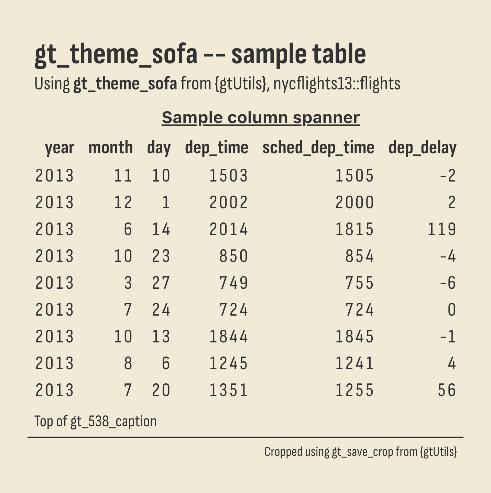
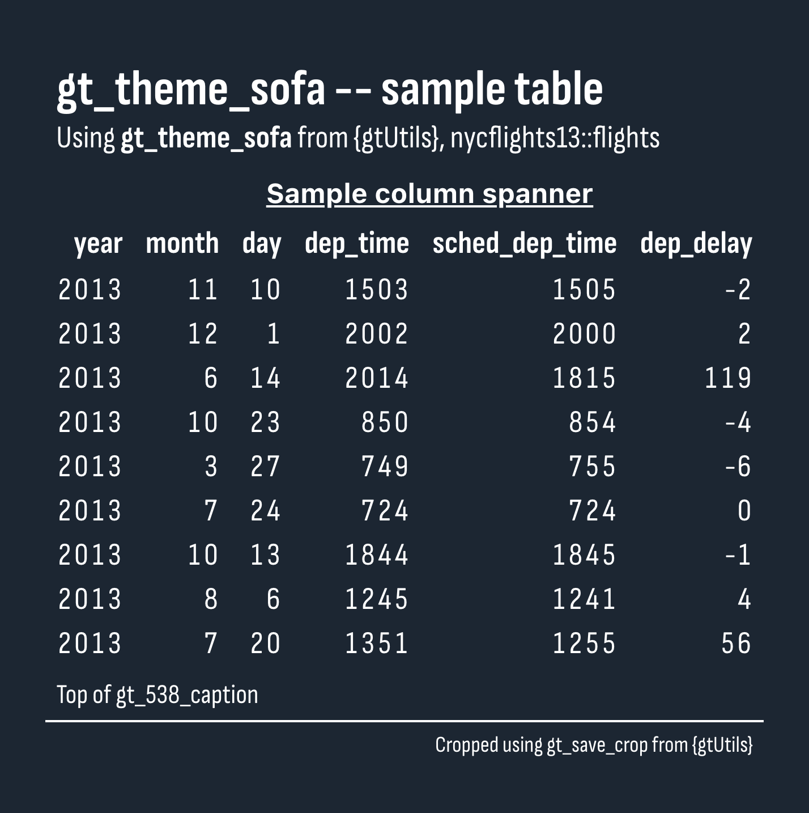

# SofaScore theme for `gt` tables

Sofia Sans Condensed throughout on a warm cream (`"light"`) or dark navy
(`"dark"`) ground, after SofaScore, with bold column labels and bold
row-group labels. Column spanners are bold and underlined. Horizontal
rules are hidden, so the ground alone separates the rows.

## Usage

``` r
gt_theme_sofa(
  gt_object,
  style = "light",
  density = c("comfortable", "compact", "social"),
  ...
)
```

## Arguments

- gt_object:

  A `gt` table object to modify.

- style:

  Character. The color scheme, `"light"` for a warm cream ground or
  `"dark"` for a dark navy ground. Defaults to `"light"`.

- density:

  Character. The type and padding scale. One of `"comfortable"`,
  `"compact"`, or `"social"`. See Density. Defaults to `"comfortable"`.

- ...:

  Additional arguments passed to
  [`gt::tab_options`](https://gt.rstudio.com/reference/tab_options.html),
  applied last so they override anything the theme sets.

## Value

Returns a modified `gt` table with the theme applied.

## Details

The table background, its outer borders, and the last row's bottom
border are all painted in the chosen ground color, so the rows read as
separated by space rather than by rules. Row groups are closed with a
black bottom border.

## Density

`density` scales the theme's type and row padding together.
`"comfortable"` leaves every size as the theme sets it, `"compact"`
scales both down, and `"social"` scales both up, to the scale
[`gt_save_crop()`](https://andreweatherman.github.io/gtUtils/reference/gt_save_crop.md)
and
[`gt_social_crop()`](https://andreweatherman.github.io/gtUtils/reference/gt_social_crop.md)
export at.

## Figures



## Examples

``` r
if (FALSE) { # \dontrun{
library(gt)
gt(head(mtcars)) %>% gt_theme_sofa()
gt(head(mtcars)) %>% gt_theme_sofa(style = "dark")
} # }
```
