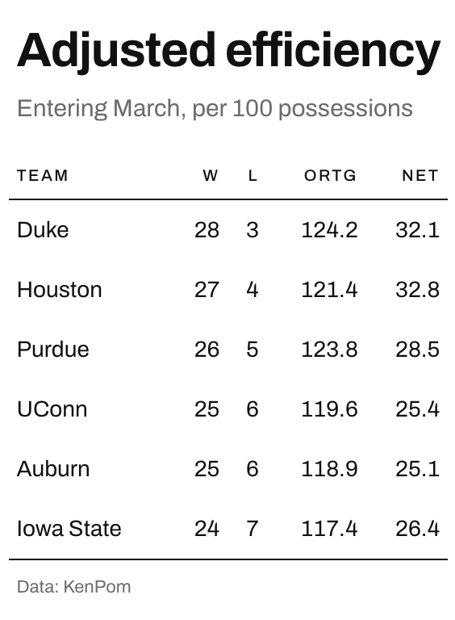

# International Typographic Style theme for `gt` tables

Builds the table on whitespace. There are no fills, no banding, and
exactly two rules in the whole table, one under the column labels and
one closing the body. Everything else is done with space and alignment.

## Usage

``` r
gt_theme_swiss(
  gt_object,
  accent = "#111111",
  density = c("comfortable", "social", "compact"),
  ...
)
```

## Arguments

- gt_object:

  A `gt` table object to modify.

- accent:

  Character. A hex color, used once, on the rule beneath the column
  labels. Defaults to `"#111111"`, which reads as no color at all.

- density:

  Character. The type and padding scale. One of `"comfortable"`,
  `"compact"`, or `"social"`. See Density. Defaults to `"comfortable"`.

- ...:

  Additional arguments passed to
  [`gt::tab_options`](https://gt.rstudio.com/reference/tab_options.html),
  applied last so they override anything the theme sets.

## Value

Returns a modified `gt` table with the theme applied.

## Details

Alignment is strict. Text sits flush left, numbers flush right, and
nothing is centered.

## Density

`density` sets the type and padding scale together. `"comfortable"` uses
a 14px body with roomy rows, `"compact"` a 12px body with tight rows,
and `"social"` a 17px body with generous rows and a larger title, at the
scale
[`gt_save_crop()`](https://andreweatherman.github.io/gtUtils/reference/gt_save_crop.md)
and
[`gt_social_crop()`](https://andreweatherman.github.io/gtUtils/reference/gt_social_crop.md)
export at.

## Figures



## Examples

``` r
if (FALSE) { # \dontrun{
library(gt)
gt(head(mtcars)) %>% gt_theme_swiss()
gt(head(iris)) %>% gt_theme_swiss(accent = "#D33A2C")
} # }
```
