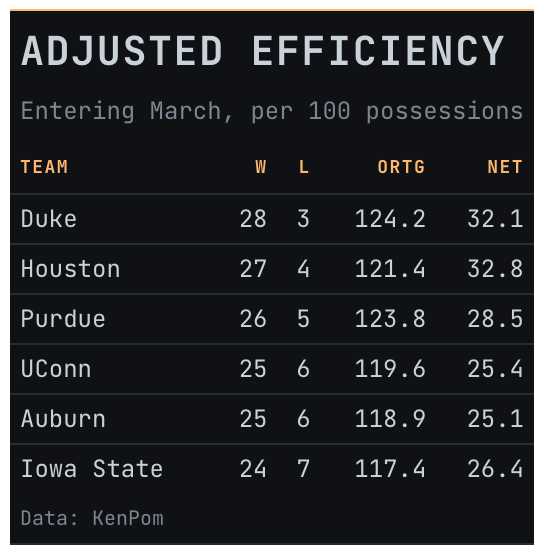

# Data-terminal theme for `gt` tables

A dense monospace theme in the register of a trading terminal. Dark
background, amber labels, a rule on every row, and tight padding.

## Usage

``` r
gt_theme_terminal(
  gt_object,
  accent = "#FFB86C",
  density = c("compact", "comfortable", "social"),
  ...
)
```

## Arguments

- gt_object:

  A `gt` table object to modify.

- accent:

  Character. A hex color for the column labels, row groups, and the top
  rule. Defaults to amber `"#FFB86C"`; `"#7EE787"` gives a
  green-phosphor variant.

- density:

  Character. The type and padding scale. One of `"comfortable"`,
  `"compact"`, or `"social"`. See Density. Defaults to `"compact"`.

- ...:

  Additional arguments passed to
  [`gt::tab_options`](https://gt.rstudio.com/reference/tab_options.html),
  applied last so they override anything the theme sets.

## Value

Returns a modified `gt` table with the theme applied.

## Details

The monospace face has fixed-width digits already, so numeric columns
line up without any extra formatting.

## Density

`density` sets the type and padding scale together. `"comfortable"` uses
a 14px body with roomy rows, `"compact"` a 12px body with tight rows,
and `"social"` a 17px body with generous rows and a larger title, at the
scale
[`gt_save_crop()`](https://andreweatherman.github.io/gtUtils/reference/gt_save_crop.md)
and
[`gt_social_crop()`](https://andreweatherman.github.io/gtUtils/reference/gt_social_crop.md)
export at.

## Figures



## See also

[pal_midnight](https://andreweatherman.github.io/gtUtils/reference/pal_midnight.md)
for a color scale that survives a dark ground.

## Examples

``` r
if (FALSE) { # \dontrun{
library(gt)
gt(head(mtcars, 12)) %>% gt_theme_terminal()
gt(head(airquality, 15)) %>% gt_theme_terminal(accent = "#7EE787")
} # }
```
