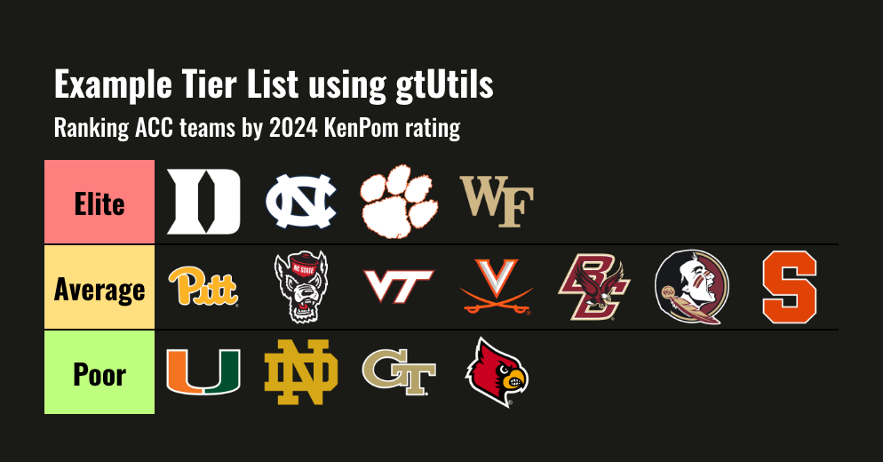

# Tier list theme for `gt` tables

Oswald throughout on a near-black (`"dark"`) or white (`"light"`)
ground, with a bold title and every column center aligned. Rows are
separated by thin black borders and horizontal rules are otherwise
hidden.

## Usage

``` r
gt_theme_tier(
  gt_object,
  style = "dark",
  density = c("comfortable", "compact", "social"),
  ...
)
```

## Arguments

- gt_object:

  A `gt` table object to modify.

- style:

  Character. The color scheme, `"dark"` for a near-black ground or
  `"light"` for a white ground. Defaults to `"dark"`.

- density:

  Character. The type and padding scale. One of `"comfortable"`,
  `"compact"`, or `"social"`. See Density. Defaults to `"comfortable"`.

- ...:

  Additional arguments passed to
  [`gt::tab_options`](https://gt.rstudio.com/reference/tab_options.html),
  applied last so they override anything the theme sets.

## Value

Returns a modified `gt` table with the theme applied.

## Details

Every body row except the last carries a black bottom border, and the
last row's border is painted in the ground color so it does not double
the edge of the table. Pairs with
[`gt_tiers()`](https://andreweatherman.github.io/gtUtils/reference/gt_tiers.md),
which builds the tier rows themselves.

## Density

`density` scales the theme's type and row padding together.
`"comfortable"` leaves every size as the theme sets it, `"compact"`
scales both down, and `"social"` scales both up, to the scale
[`gt_save_crop()`](https://andreweatherman.github.io/gtUtils/reference/gt_save_crop.md)
and
[`gt_social_crop()`](https://andreweatherman.github.io/gtUtils/reference/gt_social_crop.md)
export at.

## Figures



## Examples

``` r
if (FALSE) { # \dontrun{
library(gt)
gt(head(mtcars)) %>% gt_theme_tier()
gt(head(mtcars)) %>% gt_theme_tier(style = "light")
} # }
```
