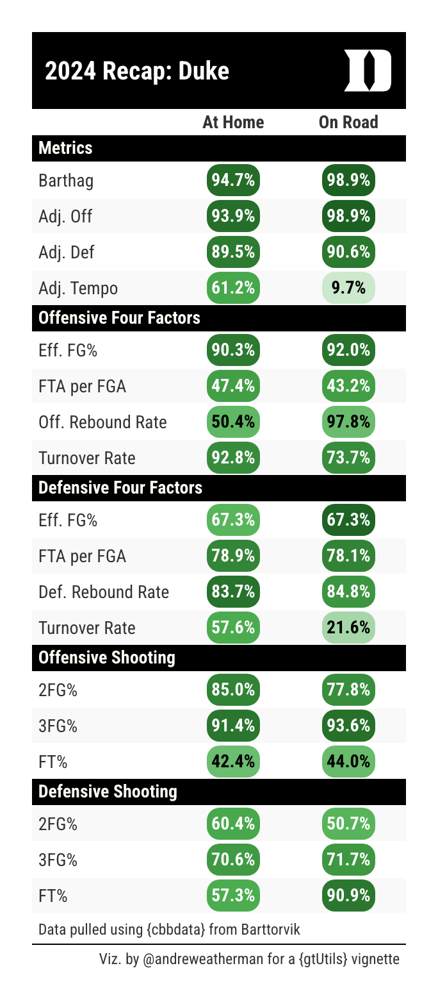
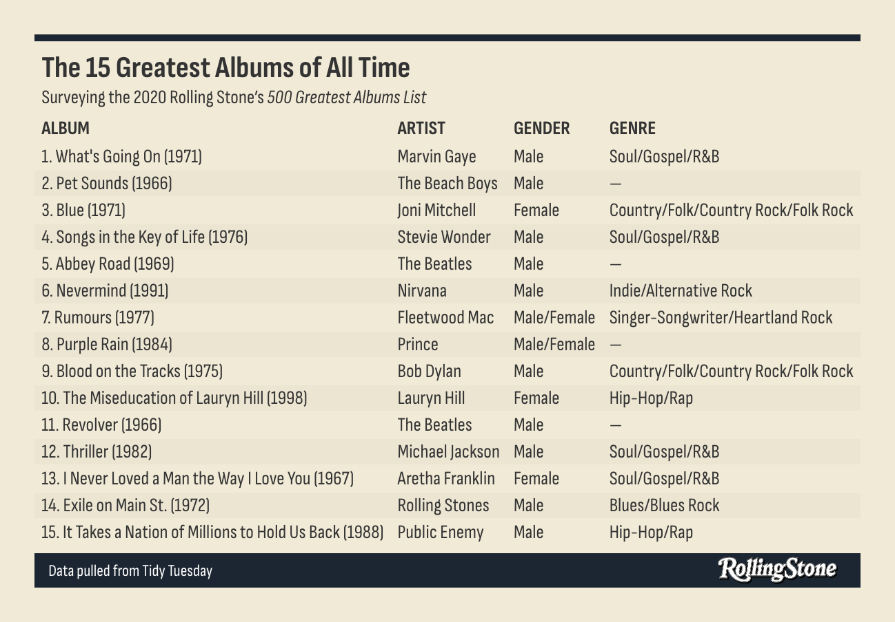
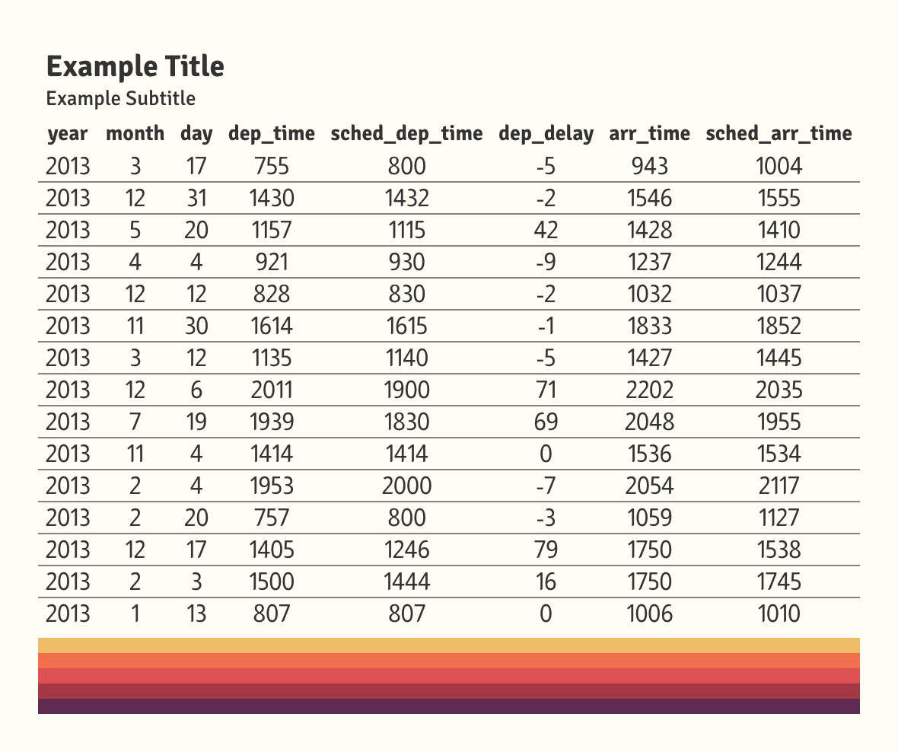

```{r, include = FALSE}
knitr::opts_chunk$set(
  collapse = TRUE,
  comment = "#>",
  out.width = "75%",
  fig.align = "center",
  eval = FALSE
)
```

I'll be honest: I didn't know what to call this function. I still don't think that `gt_border_bars` is a particularly *good* name. That said, this function offers *so much* versatility for your table designs.

In essence, it places colored bars at the top or bottom of your table. You're able to stack as many bars as you'd like, or you could pick just one color and include an image or text. The inspiration for this function came from two different places: a) it opens the possibility of more professional table footers with company logos and b) you can include team logos or player headshots at the top of table recaps.

In this vignette, we're going to explore three distinct uses of the `gt_border_bars` family.

```{r setup, eval=FALSE}
library(cbbdata)
library(tidyverse)
library(gt)
library(gtUtils)
```

## Team Reports

I'm a basketball guy at heart. A lot of my visualization work concerns college basketball -- so let's create a 2024 metric recap for Duke, my alma mater, using `gt_border_bars_top`.

For data, we're going to use my [{cbbdata} package](https://cbbdata.aweatherman.com). The purpose of this vignette is to show off some quick uses of the function, so we're going to skip most discussion around the processing of this data.

Let's define the metrics we care about and whether a higher value is better. We're going to plot national percentiles on a location split (home vs. away).

```{r}
stats_to_consider <- c(
  "team", "barthag", "adj_o", "adj_d", "adj_t", "efg", "def_efg", "ftr", "def_ftr",
  "oreb_rate", "dreb_rate", "tov_rate", "def_tov_rate",
  "two_pt_pct", "three_pt_pct", "ft_pct", "def_two_pt_pct",
  "def_three_pt_pct", "def_ft_pct"
)

higher_better <- c(
  "barthag", "adj_o", "adj_t", "efg", "ftr", "oreb_rate", "def_tov_rate",
  "two_pt_pct", "three_pt_pct", "ft_pct"
)
```

Let's get the data:

```{r}
home_splits <- cbd_torvik_team_factors(venue = "home", year = 2024) %>%
  select(all_of(stats_to_consider))

away_splits <- cbd_torvik_team_factors(venue = "away", year = 2024) %>%
  select(all_of(stats_to_consider))
```

Here's a quick function to take that data and calculate percentiles using `dplyr`. We're going to pivot the data to a long format for later use.

```{r}
calculate_percentiles <- function(data, location) {
  data %>%
    mutate(across(all_of(higher_better), ~percent_rank(.x)),
           across(setdiff(stats_to_consider, c("team", higher_better)), ~percent_rank(-.x))) %>%
    pivot_longer(-team, names_to = "stat", values_to = "percentile") %>%
    mutate(location = location)
}
```

Now, let's calculate those percentiles on each split and combine the data. We need to pivot the final result to a wide format so that we can plot home and away *columns*.

```{r}
home_percentiles <- calculate_percentiles(home_splits, "home")
away_percentiles <- calculate_percentiles(away_splits, "away")

final_data <- bind_rows(home_percentiles, away_percentiles) %>%
  pivot_wider(names_from = location, values_from = percentile)
```

For final processing, we need to do two more things: a) add the general "group" of each stat and b) rename each stat to something more readable:

```{r}
dict <- data.frame(
  stat = unique(final_data$stat),
  new_name = c("Barthag", "Adj. Off", "Adj. Def", "Adj. Tempo", "Eff. FG%", "Eff. FG%",
               "FTA per FGA", "FTA per FGA", "Off. Rebound Rate", "Def. Rebound Rate",
               "Turnover Rate", "Turnover Rate", "2FG%", "3FG%", "FT%", "2FG%", "3FG%", "FT%")
) %>% deframe()

final_data <- final_data %>%
  filter(team == "Duke") %>%
  mutate(
    stat_group = case_when(
      stat %in% c("barthag", "adj_o", "adj_d", "adj_t") ~ "Metrics",
      stat %in% c("efg", "ftr", "oreb_rate", "tov_rate") ~ "Offensive Four Factors",
      stat %in% c("def_efg", "def_ftr", "dreb_rate", "def_tov_rate") ~ "Defensive Four Factors",
      stat %in% c("two_pt_pct", "three_pt_pct", "ft_pct") ~ "Offensive Shooting",
      .default = "Defensive Shooting"
    ),
    stat = dict[stat]
  )
```


Awesome! Now we have our data. Let's throw it over to `gt`. To create row groups in `gt`, remember to pass in your data *grouped by* that category. For this table, we are using several functions from `gtUtils`: 

-   `gt_theme_savant` theme for a clean look
-   `gt_color_pills` to fill our two percentile columns. Notice that we are formatting each as a percent and trimming to one digit. We also set our domain, [0, 1], and pass through a palette.
-   `gt_538_caption` to include some more information at the bottom of the table.

All said, `gt_border_bars_top` is the function that we really care about. To keep with our theming, we are using a solid black border. We are passing through a link to the dark-mode Duke logo. You will need to play around with `bar_height` when you include an image. By default, the function will pick-up the font family that your theme uses for table headers. You can also mess around with `text_padding`, or you can switch image/text positions by using `text_align` or `img_align`.

This is a really quick example. You can easily get something more descriptive with additional time or effort.

```{r}
final_data %>%
  group_by(stat_group) %>%
  gt() %>%
  cols_hide(team) %>%
  gt_theme_savant() %>%
  gt_color_pills(home,
    domain = c(0, 1), format_type = "percent", digits = 1,
    palette = "ggsci::green_material"
  ) %>%
  gt_color_pills(away,
    domain = c(0, 1), format_type = "percent", digits = 1,
    palette = "ggsci::green_material"
  ) %>%
  gt_538_caption("Data pulled using {cbbdata} from Barttorvik", "Viz. by @andreweatherman for a {gtUtils} vignette") %>%
  cols_width(home:away ~ px(90)) %>%
  cols_label(stat = "", home = "At Home", away = "On Road") %>%
  cols_align(columns = -stat, "center") %>%
  tab_style(locations = cells_body(columns = -stat), cell_text(weight = "bold")) %>%
  tab_options(column_labels.border.top.style = "none") %>%
  gt_border_bars_top(
    colors = "black",
    img = "https://a.espncdn.com/i/teamlogos/ncaa/500-dark/150.png",
    text = "2024 Recap: Duke",
    text_padding = 10,
    text_size = 20,
    img_width = 40,
    img_height = 40,
    bar_height = 60
  )
```

```{r, echo=FALSE, eval=TRUE}

```

## Table Footers

Another possibility is using `gt_border_bars_bottom` to include a company or personal logo. For this example, let's pull a TidyTuesday dataset about Rolling Stone's "500 Greatest Albums" and pull the top 15.

```{r}
data <- read_csv("https://raw.githubusercontent.com/rfordatascience/tidytuesday/master/data/2024/2024-05-07/rolling_stone.csv") %>% 
  slice_min(rank_2020, n = 15)
```

Again, this is a really quick and small example. The table itself is pretty basic. We use `gt_theme_sofa` on light mode, throw in some row striping, and include *both* top and bottom bars. In the bottom bar, we add some source text, push it 12px size, and toss it on normal weight. The image we placed in the bottom *could* be clearer, but there's nothing that we can do about that. We stretch it to 100px wide and 30px tall. And with fewer than 20 lines of code, we have a decent start to a table!

```{r}
data %>%
  mutate(album = paste0(rank_2020, ". ", album, " (", release_year, ")")) %>%
  select(c(album, artist = clean_name, gender = artist_gender, genre)) %>%
  gt(id = "table") %>%
  gt_theme_sofa() %>%
  sub_missing() %>%
  cols_align(columns = "artist", "left") %>%
  opt_all_caps() %>%
  opt_row_striping() %>%
  gt_border_bars_bottom("#1c2632",
    bar_height = 25,
    img = "https://www.sxsw.com/wp-content/uploads/2022/11/RollingStone-BW.png",
    text = "Data pulled from Tidy Tuesday",
    img_width = 100, img_height = 30, text_size = 12, text_weight = "normal"
  ) %>%
  gt_border_bars_top("#1c2632", bar_height = 5) %>%
  tab_header(
    title = "The 15 Greatest Albums of All Time",
    subtitle = md("Surveying the 2020 Rolling Stone's *500 Greatest Albums List*")
  )
```

```{r, echo=FALSE, eval=TRUE}

```

## Just for fun

Another use of these functions is to add some pizzazz to your table. With `gt_border_bars`, you don't need to add any text or image! Let's whip up a quick example and place some bars on the bottom for fun.

If you do not specify text or an image, you can have as many bars as you'd like -- all being placed with equal heights. They are plotted in sequential order, meaning that the first color in your vector is placed at the top and the last color is at the bottom.

```{r}
data <- withr::with_seed(
  seed = 10,
  {
    nycflights13::flights %>% 
      slice_sample(n = 15) %>% 
      select(1:8)
  }
)

data %>% 
  gt() %>% 
  gt_theme_gtutils() %>% 
  tab_header("Example Title", "Example Subtitle") %>% 
  gt_border_bars_bottom(c("#EDBD68", "#F2704E", "#DE5152", "#A43845", "#602B53"))
  
```

```{r, echo=FALSE, eval=TRUE}

```
