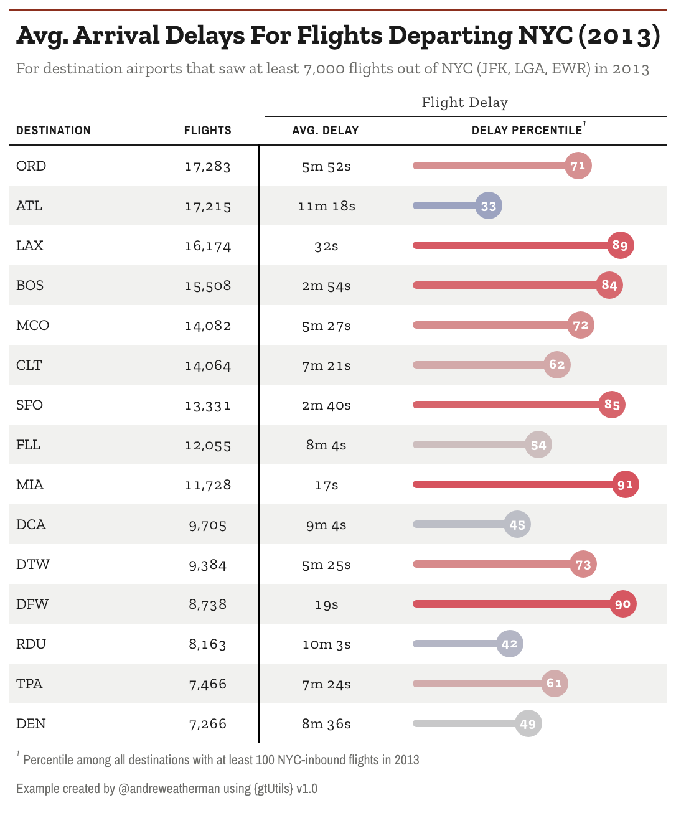
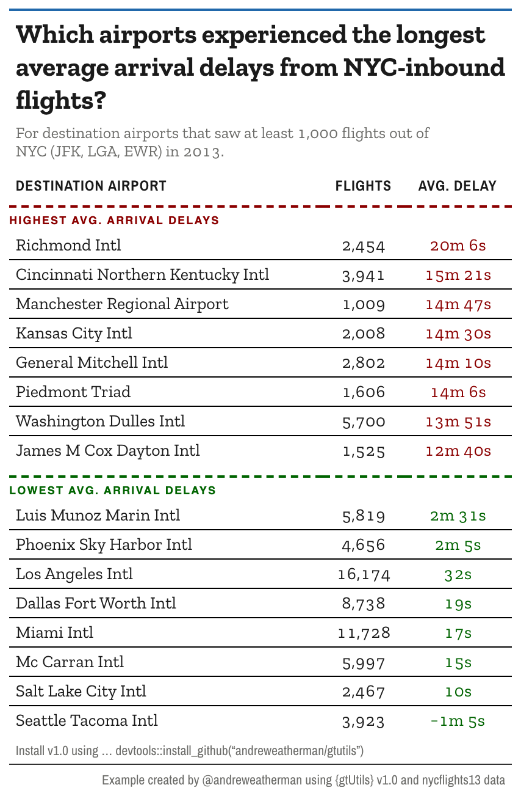

```{r, include = FALSE}
knitr::opts_chunk$set(
  collapse = TRUE,
  comment = "#>",
  message = FALSE,
  warning = FALSE,
  eval = FALSE
)
```

```{r setup, echo = FALSE}
library(gtUtils)
library(gt)
library(gtExtras)
library(tidyverse)
```

A table of numbers tells you the values. It does not tell you which ones stand
out, or where the line falls between a good group and a bad one. Two `v1.0`
functions handle those jobs: `gt_percentile_bar()` draws each value against the
field it belongs to, and `gt_cutline()` marks a break between rows. This
vignette builds one table with each, using flight data from
[`nycflights13`](https://github.com/tidyverse/nycflights13).


## Percentile bars

We start with the 15 busiest destinations out of NYC and their average arrival
delay. Alongside the raw delay we compute a percentile, so each destination can
be read against every other qualifying airport, not just the 15 shown.

```{r}
d1 <- nycflights13::flights %>%
  filter(n() >= 150, .by = dest) %>%
  summarize(
    avg_delay = mean(arr_delay, na.rm = TRUE),
    flights = n(),
    .by = dest
  ) %>%
  mutate(delay_ptile = cume_dist(-avg_delay)) %>%
  slice_max(flights, n = 15) %>%
  select(dest, flights, avg_delay, delay_ptile)
```

`cume_dist(-avg_delay)` gives the percentile of each destination's delay, and the
minus sign flips it so a low delay is a high percentile (a good result). The
value comes out on a 0-1 scale, which matters in a moment.

Now the table. `gt_percentile_bar()` turns the percentile column into a filled
track with a numbered marker at the tip.

```{r}
d1 %>%
  arrange(desc(flights)) %>%
  gt(id = "table") %>%
  gt_theme_almanac() %>%
  gt_percentile_bar(delay_ptile, full_track = FALSE) %>%
  fmt_duration(avg_delay, input_units = "mins") %>%
  fmt_number(flights, decimals = 0) %>%
  tab_spanner(columns = contains("delay"), "Flight Delay") %>%
  cols_align(columns = -dest, "center") %>%
  gt_add_divider(flights, color = "black", weight = px(1.5), include_labels = FALSE) %>%
  cols_label(
    dest = "Destination",
    delay_ptile = "Delay percentile",
    avg_delay = "Avg. Delay"
  ) %>%
  tab_footnote(
    locations = cells_column_labels(delay_ptile),
    footnote = "Percentile among all destinations with at least 100 NYC-inbound flights in 2013"
  ) %>%
  tab_header(
    "Avg. Arrival Delays For Flights Departing NYC (2013)",
    "For destination airports that saw at least 7,000 flights out of NYC (JFK, LGA, EWR) in 2013"
  ) %>%
  tab_source_note(
    "Example created by @andreweatherman using {gtUtils} v1.0"
  )
```

```{r, eval=TRUE, echo=FALSE}

```

The `delay_ptile` column is stored on a 0-1 scale, but the markers read 71, 33,
89, and so on. That is `gt_percentile_bar()`'s `scale` argument, which defaults
to `"auto"`: a column whose values all fall in `[0, 1]` is treated as a
proportion and mapped onto the 0-100 percentile axis, so a raw `0.71` prints as
`71`. A column already on a 0-100 scale is left alone, so the same code works
either way. Set `scale = "none"` to turn that off.

The other arguments cover the look:

- `domain`: the value range the bar spans, `c(0, 100)` by default.
- `palette`: colors mapped across the domain, used for both the fill and the
  marker. The default runs blue at the low end through grey to red at the high
  end.
- `full_track`: whether the unfilled track runs the full width or stops at the
  marker. We set it to `FALSE` here so each bar ends at its own value.
- `marker_size`, `track_height`, `text_color`, `decimals`: the size of the
  marker, the thickness of the track, the color of the number inside the marker,
  and its decimal places.
- `na_label`: what to show for a missing percentile. It defaults to an em dash
  and draws a broken track, so an empty row cannot be misread as a percentile of
  zero.

The whole bar is CSS, not an image, so it stays sharp at any export size.

## Cut lines

The second table asks a different question: of the destinations with real
volume, which had the worst arrival delays and which had the best? We take the 8
highest and 8 lowest average delays and stack them in one sorted table.

```{r}
airport_dict <- nycflights13::airports$name %>% set_names(nycflights13::airports$faa)

d2 <- nycflights13::flights %>%
  filter(n() >= 1000, .by = dest) %>%
  summarize(
    avg_delay = mean(arr_delay, na.rm = TRUE),
    flights = n(),
    .by = dest
  ) %>%
  arrange(desc(avg_delay)) %>%
  slice(c(1:8, (n() - 7):n())) %>%
  mutate(dest = airport_dict[dest],
         dest = ifelse(is.na(dest), "Luis Munoz Marin Intl", dest)) %>%
  select(dest, flights, avg_delay)
```

`arrange(desc(avg_delay))` puts the worst delays on top, then
`slice(c(1:8, (n() - 7):n()))` keeps the first 8 and last 8, already sorted worst
to best.

```{r}
d2 %>%
  gt(id = "table") %>%
  gt_theme_almanac(accent = "#2168AB") %>%
  gt_cutline(after = 0, "Highest Avg. Arrival Delays", color = "darkred") %>%
  gt_cutline(after = 8, "Lowest Avg. Arrival Delays", color = "darkgreen", gap = c(12, 0)) %>%
  opt_row_striping(FALSE) %>%
  fmt_duration(avg_delay, input_units = "mins") %>%
  fmt_number(flights, decimals = 0) %>%
  tab_style(locations = cells_body(rows = 1:8, columns = avg_delay), style = cell_text(color = "darkred")) %>%
  tab_style(locations = cells_body(rows = 9:nrow(d2), columns = avg_delay), style = cell_text(color = "darkgreen")) %>%
  tab_style(locations = cells_body(), style = cell_text(size = px(14))) %>%
  cols_label(
    dest = "Destination Airport",
    avg_delay = "Avg. Delay"
  ) %>%
  cols_align(columns = -dest, "center") %>%
  tab_options(
    table_body.hlines.style = "solid",
    table_body.hlines.color = "black",
    table_body.hlines.width = px(1)
  ) %>%
  opt_css(
    "
    #table .gt_col_heading { padding-bottom: 8px !important; font-size: 12px !important; }
    "
  ) %>%
  tab_header(
    md("Which airports experienced the longest<br>average arrival delays from NYC-inbound<br>flights?"),
    md("For destination airports that saw at least 1,000 flights out of<br>NYC (JFK, LGA, EWR) in 2013.")
  ) %>%
  gt_538_caption(
    md('Install v1.0 using ... devtools::install_github("andreweatherman/gtutils")'),
    "Example created by @andreweatherman using {gtUtils} v1.0 and nycflights13 data"
  )
```

```{r, eval=TRUE, echo=FALSE}

```

There are two cut lines here, one for each group. `gt_cutline(after = 8, ...)`
draws the rule between rows 8 and 9, where the highest delays give way to the
lowest. The label sits on the line, rendered in uppercase.

The first call, `gt_cutline(after = 0, ...)`, is the useful trick. `after = 0`
draws a line above the very first row, which lets you label the top section the
same way you label the break in the middle. 

A few arguments shape the lines:

- `color`, `weight`, `style`: the color, thickness, and line style (`"dashed"`,
  `"solid"`, or `"dotted"`).
- `label`, `label_position`, `label_size`, `label_color`: the text on the line,
  whether it sits above or below, and how it looks.
- `gap`: extra space around the line, in pixels. A single number pads both sides;
  a length-2 vector `c(above, below)` sets them separately. Here `gap = c(12, 0)`
  opens room above the "Lowest" line without pushing the row below it down.

The two `tab_style()` calls color the delay values to match their group, red for
the high block and green for the low, so the split reads even without the labels.
Note `cell_text(size = px(14))` on the body: the `gt_theme_*` functions set their
font sizes per cell, so a `tab_options(table.font.size = ...)` will not move them.
Restyle the body cells directly instead, which is what that line does.

Cut lines are positional, not data-driven. `gt::tab_row_group()` splits a table
on a value in the data and adds heading rows; a cut line leaves the table flowing
and marks a fixed row number. 
