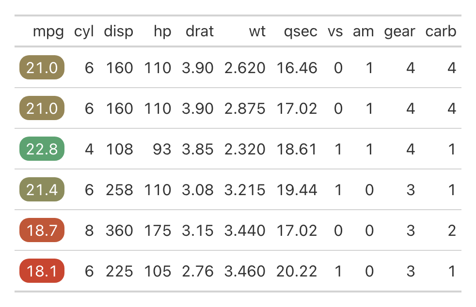

```{r, include = FALSE}
knitr::opts_chunk$set(
  collapse = TRUE,
  comment = "#>",
  message = FALSE,
  warning = FALSE,
  out.width = "75%",
  fig.align = "center",
  eval = FALSE
)
```

```{r setup, message=FALSE, eval=FALSE, echo = FALSE}
library(gtUtils)
library(gt)
library(tidyverse)
```

This vignette briefly explores functionalities possible with `gtUtils` and `gt`.

## Coloring cells with pills

This section showcases how to use the `gt_color_pills` function from the `gtUtils` package to style cells with rounded color "pills" in a table. This function is inspired by similar features in the `gtExtras` package by Thomas Mock but adds its own customizable elements for formatting and color control.

#### Basic Usage

The simplest way to use `gt_color_pills` is to apply it to a column in a gt table. By default, it will color the cells on a continuous scale.

```{r}
mtcars %>% 
  head() %>% 
  gt() %>% 
  gt_theme_sofa() %>% 
  gt_color_pills(mpg)
```

```{r, eval=TRUE, echo=FALSE}
knitr::include_graphics("images/pills-base.png")
```

#### Trimming Digits

You can control the number of decimal places displayed using the digits argument. In this example, we trim the values to one decimal place:

```{r}
mtcars %>% 
  head() %>% 
  gt() %>% 
  gt_color_pills(mpg, digits = 1)
```

```{r, eval=TRUE, echo=FALSE}

```

#### Coloring ordinal ranks

By default, `gt_color_pills` applies a continuous color scale based on the range of the data. However, you can also color based on ordinal ranks within the column by setting `fill_type` to "rank". Additionally, use `rank_order` to specify whether the highest or lowest value should be ranked first ("desc" or "asc", defaults to descending order).

```{r}
mtcars %>% 
  head() %>% 
  add_row(mpg = 1) %>% 
  gt() %>% 
  gt_color_pills(mpg, fill_type = "rank", rank_order = "asc")
```

```{r, eval=TRUE, echo=FALSE}

```

In this example, the new outlier (1 mpg) doesn’t skew the coloring of other values as it would with a continuous scale, where all higher values would be compressed into the upper part of the range (green).

#### Formatting Options

`gt_color_pills` supports several value formats: number, comma, currency, and percent. The default is "number," but you can specify the desired format using the format_type argument.

```{r}
mtcars %>%
  select(1:4) %>% 
  head() %>% 
  mutate(cyl = cyl * 10e4) %>% 
  gt() %>% 
  gt_color_pills(mpg) %>% 
  gt_color_pills(cyl, format = "comma") %>% 
  gt_color_pills(disp, format = "currency") %>% 
  gt_color_pills(hp, format = "percent", scale_percent = FALSE)
```

```{r, eval=TRUE, echo=FALSE}

```

You can also append a custom suffix to the formatted values, such as adding "mpg" to miles per gallon:

```{r}
mtcars %>% 
  head() %>% 
  gt() %>% 
  gt_color_pills(mpg, suffix = " mpg", digits = 1)
```

```{r, eval=TRUE, echo=FALSE}

```

#### Dynamic Pill Widths and Height

The width of all pills in a column dynamically adjusts to the longest value in that column, with 3px of padding on each side. You can also control the height of the pills using the pill_height argument. By default, it is set to 25px, but you can increase or decrease it as needed.

```{r}
mtcars %>% 
  head() %>% 
  gt() %>% 
  gt_color_pills(mpg, digits = 1, pill_height = 40)
```

```{r, eval=TRUE, echo=FALSE}

```


#### Automatic Text Color for Contrast

`gt_color_pills` automatically adjusts the text color inside the pill using `gt:::ideal_fgnd_color` to ensure readability. For example, with a palette ranging from white to black, the function ensures that the text color changes appropriately:

```{r}
mtcars %>% 
  head() %>% 
  gt() %>% 
  gt_color_pills(mpg, digits = 1, palette = c("#ffffff", "#000000"))
```

```{r, eval=TRUE, echo=FALSE}

```

#### Adding Borders to Pills

You can further customize the pills by adding borders using the `outline_color` and `outline_width` arguments. For example, setting a red border with a 2px width:

```{r}
mtcars %>% 
  head() %>% 
  gt() %>% 
  gt_color_pills(mpg, digits = 1, outline_color = "red", outline_width = 2, palette = c("#ffffff", "#000000"))
```

```{r, eval=TRUE, echo=FALSE}
knitr::include_graphics("images/pills-adding_borders.png")
```

## Colored indicator boxes

The `gt_indicator_boxes` function adds colored boxes to a gt table, allowing you to visually represent indicator values. This function lets you define your own rule for what qualifies as a "yes" or "no" value, choose custom colors, and decide whether to show text within the boxes.

This function was inspired by an [article published in the New York Times](https://www.nytimes.com/2024/04/19/nyregion/trump-trial-jury-news.html). Prior to making this package, I [recreated the original table using {gt} and custom HTML](https://www.bucketsandbytes.com/p/a-different-approach-to-survey-responses). A similar process is used with `gt_indicator_boxes`.

In general, the data passed to `gt` when using `gt_indicator_boxes` should be in a wide format and look something like this:

```{r}
set.seed(123)
sample_data <- tibble::tibble(
  id = 1:10,
  replicate(7, sample(c(0, 1, NA), 10, replace = TRUE), simplify = FALSE) %>%
    setNames(paste0("indicator_", 1:7)) %>%
    as_tibble()
)
```

### Basic Usage

By default, `gt_indicator_boxes` colors cells with 1 as "yes" (colored) and 0 or NA as "no" (uncolored). Here, we apply the function to all columns except for id, which serves as the key column.

```{r}
sample_data %>% 
  gt() %>% 
  gt_indicator_boxes(key_columns = "id")
```

```{r, eval=TRUE, echo=FALSE}
knitr::include_graphics("images/boxes-base.png")
```

### Changing Indicator Values

The 0-1 indicator defaults are customizable using the `indicator_vals` argument. You can specify your own values to define what is considered a "yes" or "no." For example, if your data uses 5 to represent "yes" and 0 for "no," you can set `indicator_vals = c(0, 5)`:

```{r}
set.seed(123)
data.frame(
  val_1 = sample(c(0, 5), 10, replace = TRUE),
  val_2 = sample(c(0, 5), 10, replace = TRUE)
) %>% 
  gt() %>% 
  gt_indicator_boxes(key_columns = "id", indicator_vals = c(0, 5))
```

### Showing Text Inside the Boxes

You can choose to display text inside the indicator boxes by setting `show_text = TRUE`. This is useful when you want the numeric values to be visible within the color indicators.

```{r}
sample_data %>% 
  gt() %>% 
  gt_indicator_boxes(key_columns = "id", show_text = TRUE)
```

```{r, eval=TRUE, echo=FALSE}

```

By default, NA values are hidden when using `show_text`. However, you can choose to display NA values explicitly by setting `show_na_as_na = TRUE`.

```{r}
sample_data %>% 
  gt() %>% 
  gt_indicator_boxes(key_columns = "id", show_text = TRUE, show_na_as_na = TRUE)
```

```{r, eval=TRUE, echo=FALSE}
knitr::include_graphics("images/boxes-text-na.png")
```

### Controlling Which Text is Shown

The `show_only` argument allows you to display text for specific values. You can choose to display text only for "yes" (show_only = "yes"), only for "no" (show_only = "no"), or only for NA values (show_only = "NA").

Here’s an example where we show text only for "yes" values:

```{r}
sample_data %>% 
  gt() %>% 
  gt_indicator_boxes(key_columns = "id", show_text = TRUE, show_only = "yes")
```

```{r, eval=TRUE, echo=FALSE}
knitr::include_graphics("images/boxes-show-only-yes.png")
```

### Customizing Colors

The `gt_indicator_boxes` function allows full control over the colors used for "yes," "no," and NA values. Below, we set "yes" values to green and "no" values to grey. By default, NA values will inherit the color associated with "no," but you can set a unique color for NAs.

```{r}
sample_data %>% 
  gt() %>% 
  gt_indicator_boxes(key_columns = "id", color_yes = "#28a745", color_no = "#f5f5f5", color_na = "#f39c12")
```

```{r, eval=TRUE, echo=FALSE}
knitr::include_graphics("images/boxes-custom-colors.png")
```

### Adding Borders to Boxes

You can also add borders around the indicator boxes using the `border_color` and `border_width` arguments. This is especially useful when using themes with non-white table backgrounds, as it helps the boxes stand out more clearly. By default, no border is applied, but you can specify a color and adjust the width as needed.

Here’s an example where we add black borders with a width of 0.5px while using `gt_theme_sofa`.

```{r}
sample_data %>% 
  gt() %>% 
  gt_theme_sofa() %>% 
  gt_indicator_boxes(key_columns = "id", border_color = "black", border_width = 0.5)
```

```{r, eval=TRUE, echo=FALSE}

```

### Using Custom Functions for Indicators

The `gt_indicator_boxes` function is highly flexible, allowing you to apply custom logic for determining when a box should be colored. This is particularly useful when the "yes" or "no" status is not simply based on binary values but follows more complex rules.

Let’s create a spoof sales dataset where we have multiple indicators for different metrics. We’ll use a custom function to define whether a box should be colored based on thresholds for each metric.

```{r}
set.seed(123)
product_data <- tibble::tibble(
  product_id = 1:10,
  sales = runif(10, min = 50, max = 200), 
  customer_satisfaction = runif(10, min = 0.5, max = 1),
  defect_rate = runif(10, min = 0, max = 0.1),
  return_rate = runif(10, min = 0, max = 0.2)
)
```

In this scenario, we want to define custom rules for each metric:

-   **Sales:** A "yes" indicator if sales are greater than 150.
-   **Customer Satisfaction:** A "yes" indicator if the satisfaction score is greater than 0.75.
-   **Defect Rate:** A "yes" indicator if the defect rate is less than 0.05.
-   **Return Rate:** A "yes" indicator if the return rate is less than 0.10.

```{r}
custom_indicator_function <- function(x, column_name) {
  case_when(
    column_name == "sales" ~ x > 150,
    column_name == "customer_satisfaction" ~ x > 0.75,
    column_name == "defect_rate" ~ x < 0.05,
    column_name == "return_rate" ~ x < 0.10,
    TRUE ~ NA_real_
  )
}

product_data %>%
  gt() %>%
  gt_indicator_boxes(
    key_columns = "product_id",
    indicator_rule = custom_indicator_function,
    color_yes = "#4CAF50",  
    color_no = "#FF5722"
  )

```

```{r, eval=TRUE, echo=FALSE}
knitr::include_graphics("images/boxes-custom-fx.png")
```

## 538 Captions

One of my favorite table formats ever is the footnote + caption combination in old FiveThirtyEight tables. I think it just looks so clean. I recreated it in [this blog post](https://www.bucketsandbytes.com/p/lots-of-columns-use-this-gt-trick), and now that feature is baked into `gtUtils` with the `gt_538_caption` function.

Because of how the function is created, it is not recommended to add additional footnotes if you're including this in your table. The function itself takes two arguments: `top_caption` and `bottom_caption`. The top caption is aligned to the left, while the bottom caption is aligned to the right. The top caption is essentially a footnote -- so you can edit any formatting by targetting that location -- and the bottom caption is a source note. The line separating the two will be the same color as your footnote text.

```{r}
nycflights13::flights %>% 
  slice_sample(n = 5) %>% 
  select(1:8) %>% 
  gt(id = "table") %>% 
  gt_theme_savant() %>% 
  gt_538_caption("Top of gt_538_caption", "Bottom of caption") %>% 
  tab_header("Sample table")
```

```{r, eval=TRUE, echo=FALSE}

```

For example, let's adjust the bottom text by making it larger and bold.

```{r}
nycflights13::flights %>% 
  slice_sample(n = 5) %>% 
  select(1:8) %>% 
  gt(id = "table") %>% 
  gt_theme_savant() %>% 
  gt_538_caption("Top of gt_538_caption", "Larger and bolder") %>% 
  tab_style(locations = cells_source_notes(), cell_text(weight = "bold", size = px(16))) %>% 
  tab_header("Sample table")
```

```{r, eval=TRUE, echo=FALSE}
knitr::include_graphics("images/538-caption-bold.png")
```

## Boxes for legends

The `gt_centered_legend` function allows you to create a centered title, subtitle, and a key or legend in a gt table. You can specify whether the legend labels appear inside or outside the colored boxes.

You need to pass through a legend tibble with corresponding color and label entries, like so:

```{r}
key_info <- tibble::tibble(
  color = c("#FCCF10", "#EEEEEE"),
  label = c("Yes", "No")
)

sample_data %>%
  select(1:3) %>% 
  gt() %>%
  gt_theme_savant() %>% 
  gt_indicator_boxes(key_columns = "id") %>% 
  gt_centered_legend(
    key_info = key_info,
    heading = "Sample title",
    subtitle = "Sample subtitle",
    label_placement = "outside"
  )
```

```{r, eval=TRUE, echo=FALSE}

```

You can also place the labels *inside* the colored boxes by setting `label_placement = "inside"`. This is helpful when space is limited or when you want the labels integrated with the color indicators.

```{r}
key_info <- tibble::tibble(
  color = c("#FCCF10", "#EEEEEE"),
  label = c("Yes", "No")
)

sample_data %>%
  select(1:3) %>% 
  gt() %>%
  gt_theme_savant() %>% 
  gt_indicator_boxes(key_columns = "id") %>% 
  gt_centered_legend(
    key_info = key_info,
    heading = "Sample title",
    subtitle = "Sample subtitle",
    label_placement = "inside"
  )
```

```{r, eval=TRUE, echo=FALSE}

```

## Stacked column headers

The `gt_column_subheaders` function allows you to create stacked column headers with customizable subtitles in a gt table. This is useful for displaying extra context or explanations under the main column headers.

### Basic Usage

Here’s a simple example where we add custom headings and subtitles for two columns: mpg and hp using the `mtcars` dataset.

```{r}
mtcars %>%
  head() %>%
  select(mpg, hp) %>% 
  gt() %>%
  gt_theme_savant() %>% 
  gt_column_subheaders(
    mpg = list(heading = "Miles per Gallon", subtitle = "Fuel Efficiency"),
    hp = list(heading = "Horsepower", subtitle = "Power Output"),
    heading_color = "black",
    subtitle_color = "gray"
  )
```

```{r, eval=TRUE, echo=FALSE}

```

### Customizing Headings and Subtitles

You can easily customize the colors and font weights for both the main headings and subtitles by using the `heading_color`, `subtitle_color`, `heading_weight`, and `subtitle_weight` arguments.

For instance, here’s how you can apply different colors and font styles:

```{r}
mtcars %>%
  head() %>%
  select(mpg, hp) %>% 
  gt() %>%
  gt_theme_savant() %>% 
  gt_column_subheaders(
    mpg = list(heading = "Miles per Gallon", subtitle = "Fuel Efficiency"),
    hp = list(heading = "Horsepower", subtitle = "Power Output"),
    heading_color = "darkred",
    subtitle_color = "black",
    heading_weight = "normal",
    subtitle_weight = "lighter"
  )
```

```{r, eval=TRUE, echo=FALSE}
knitr::include_graphics("images/stacked-headers-custom.png")
```

## Stacking multiple tables

The `gt_stack_tables` function allows you to vertically stack multiple gt tables into a single output. This is particularly useful when you want to display or save multiple tables in one continuous view, e.g. a game box score.

For example, let's define three sample tables. In the first table, we're going to include a table header and subheader. In the final table, we're going to include a caption. We're not going to include *any* annotations in the final table.

```{r}
tab1 <- nycflights13::flights %>% 
  select(2:8) %>% 
  slice_sample(n = 5) %>% 
  gt() %>% 
  gt_theme_kenpom() %>% 
  tab_header("Stacked Tables", "An example using gt_stack_tables")

tab2 <- nycflights13::flights %>% 
  select(2:8) %>% 
  slice_sample(n = 5) %>% 
  gt() %>% 
  gt_theme_kenpom()

tab3 <- nycflights13::flights %>% 
  select(2:8) %>% 
  slice_sample(n = 5) %>% 
  gt() %>% 
  gt_theme_kenpom() %>% 
  gt_538_caption("You can include a caption on the bottom table", "Lower captions too")
```

When using `gt_stack_tables`, simply pass the tables as a list:

```{r}
gt_stack_tables(list(tab1, tab2, tab3))
```

```{r, eval=TRUE, echo=FALSE}

```

## Saving and cropping tables

One of the most useful features for creating polished, ready-to-share tables is the `gt_save_crop` function. This function not only saves the table as an image but also trims any excess whitespace. It’s particularly useful when you want to save a version of your table for use on social media, etc.

Behind the scenes, `gt_save_crop` leverages `gtsave_extra` from the `{gtExtras}` package -- which itself uses `webshot2` -- and then passes a temporary save of that table to `magick`. There, `magick` will automatically crop your table with even whitespace widths on all sides.

The `bg` argument controls the color of the background added around the table. By default, it’s set to "white", but you can specify any valid color. If you are using a theme from `gtUtils` and are unsure what background color to use, you can reference the theme’s background color using `gtUtils::theme_bg` to ensure consistency across your tables.

All tables on this site, bar for a few at the top of this vignette, were saved with this function.

```{r}
mtcars %>%
  head() %>%
  gt() %>%
  gt_save_crop(file = "cropped_table.png", whitespace = 40, bg = "white")
```

