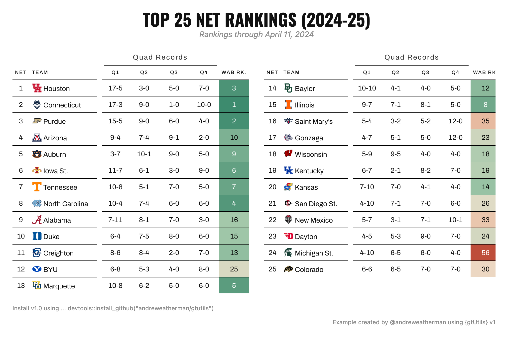
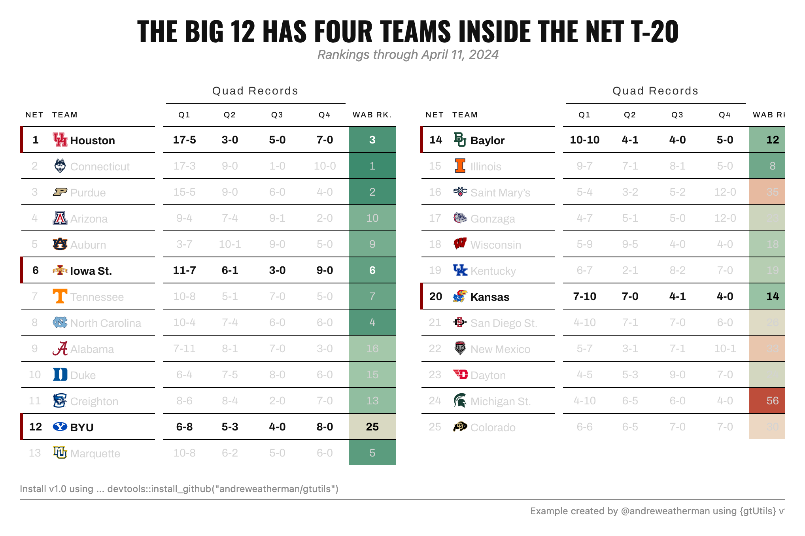

```{r, include = FALSE}
knitr::opts_chunk$set(
  collapse = TRUE,
  comment = "#>",
  message = FALSE,
  warning = FALSE,
  eval = FALSE
)
```

```{r setup, echo = FALSE}
library(gtUtils)
library(gt)
library(cbbplotR)
library(tidyverse)
```

Nobody likes a long table. Put 25 rows next to a handful of columns and you get
an image twice as tall as it is wide, mostly empty, with half the values
scrolled off the bottom of a feed. The fix is to fold that one tall table into
two shorter ones and set them side by side.

The [old trick](https://www.bucketsandbytes.com/p/lots-of-columns-use-this-gt-trick)
for this was to pivot everything into a wide format first, hand `gt` a single
frame, and rename every column with a suffix. It works, but it is fiddly, and
per-cell coloring gets awkward once the data is reshaped.

`v1.0` adds `gt_grid()`, which goes the other way. You build each block as a
normal `gt` table, put the tables in a list, and `gt_grid()` arranges the list.
Nothing gets reshaped, so every block is a real table you can style with the
rest of the package. This vignette uses two other new `v1.0` functions along the
way, `gt_color_ranks()` and `gt_spotlight()`, and covers what each one does.

## The data

We start with the top 25 of the NCAA's NET rankings (from 2024-25), each team's quadrant
records, and its Wins Above Bubble (WAB) rank. The last line is the only unusual
step. [`cbbplotR`](https://cbbplotr.aweatherman.com/)'s `gt_cbb_teams()` replaces
the team name with a logo-and-name markdown string, which we render later with
`fmt_markdown()`.

```{r}
data <- read_csv("net_example.csv") %>%
  filter(net <= 25) %>%
  select(net, team, quad1, quad2, quad3, quad4, wins_above_bubble_rk, conf) %>%
  gt_cbb_teams(team, logo_height = 20)
```

Before splitting anything, two values are computed once, off the full table.

```{r}
wab_domain <- range(data$wins_above_bubble_rk, na.rm = TRUE)

sizes  <- c(13, 12)
chunks <- split(data, rep(seq_along(sizes), sizes))
```

`wab_domain` is the range of the WAB rank column across all 25 teams, and it
matters because of how coloring works. A color scale is built from whatever data
it sees. If each block builds its own scale, block one maps its colors to teams
1 to 13 and block two maps to teams 14 to 25, so the same rank lands on a
different shade depending on which block a team happens to fall in. Computing the
domain once and handing it to both blocks keeps one scale across the whole table.

`sizes` sets the split. We want 13 rows in the first block and 12 in the second.
`rep(seq_along(sizes), sizes)` turns `c(13, 12)` into 13 `1`s followed by 12
`2`s, and `split()` cuts the data on that. For three blocks, use `c(9, 8, 8)`.
The layout follows from the sizes you pick.

## Coloring a column by rank

Inside the table we color the WAB rank column with `gt_color_ranks()`, another
new `v1.0` function.

```{r, eval = FALSE}
gt_color_ranks(wins_above_bubble_rk, domain = wab_domain)
```

The arguments worth knowing:

- `palette`: either a vector of hex colors or a `paletteer` palette named as
  `"package::palette"`. The default is a 5-color green-to-red ramp, which reads
  as good-to-bad.
- `domain`: the value range mapped onto the palette. Left `NULL`, it is taken
  from the column itself. We pass `wab_domain` so both blocks share a scale.
- `reverse`: flip the palette, for when low numbers should be red instead of
  green.
- `pal_type`: `"discrete"` or `"continuous"`, which only matters when you hand it
  a `paletteer` palette.
- `na_color`: fill for missing values, white by default.
- `autocolor_text`: sets the text color for contrast against the fill, so dark
  cells get light text automatically. On by default.

It colors values as they are and does not rank for you, so it works on any
numeric column. Reach for a `paletteer` palette when you want something other than
the default ramp:

```{r, eval = FALSE}
gt_color_ranks(wins_above_bubble_rk, palette = "viridis::mako",
               pal_type = "continuous", reverse = TRUE)
```

## One table, applied to each block

Every block is a `gt` table, so we write the recipe once and `lapply()` it over
the chunks. None of this is grid-specific. It is the same table you would build
for a single frame.

```{r}
tbls <- lapply(chunks, function(x) {
  gt(x) %>%
    gt_theme_swiss() %>%
    cols_hide(conf) %>%
    cols_align(columns = -c(team), align = "center") %>%
    cols_align(columns = team, "left") %>%
    cols_label(team = "Team", net = "NET", wins_above_bubble_rk = "WAB Rk.") %>%
    cols_label_with(columns = starts_with("quad"),
                    fn = function(x) paste0("Q", parse_number(x))) %>%
    cols_width(team ~ px(140), starts_with("quad") ~ px(60)) %>%
    tab_spanner(columns = starts_with("quad"), label = "Quad Records") %>%
    gt_color_ranks(wins_above_bubble_rk, domain = wab_domain) %>%
    fmt_markdown(team) %>%
    gt_add_divider(team, color = "white", weight = px(10)) %>%
    tab_options(
      data_row.padding = px(6),
      table_body.hlines.style = "solid",
      table_body.hlines.color = "black",
      table_body.hlines.width = px(1)
    )
})
```

`gt_color_ranks(..., domain = wab_domain)` is the shared scale from earlier.
`fmt_markdown(team)` renders the logo strings `gt_cbb_teams()` produced.
`gt_add_divider()` (from `gtExtras`) adds a white gap after the team column so
the records do not crowd the logos.

`cols_hide(conf)` keeps the conference column in the data but hides it from the
table (for the second example).

## Laying it out with gt_grid

Now the list goes to `gt_grid()`.

```{r}
gt_grid(tbls, ncol = 2, gap = 30,
        title = "Top 25 NET Rankings (2024-25)",
        subtitle = "Rankings through April 11, 2024",
        title_style = list(font = "Oswald", size = 34, transform = "uppercase",
                           margin_bottom = -4),
        subtitle_style = list(italic = TRUE, color = "#8A8A8A"),
        caption = md('Install v1.0 using ... devtools::install_github("andreweatherman/gtutils")'),
        caption_style = list(align = "left"),
        source_note = "Example created by @andreweatherman using {gtUtils} v1.0",
        caption_rule = TRUE)
```

```{r, eval=TRUE, echo=FALSE}

```

`ncol` sets how many tables go across, and the number of rows follows from the
list length. `gap` is the space between them in pixels. There is also an `align`
argument (`"top"`, `"center"`, `"bottom"`) for when the blocks are different
heights, which is common with an uneven split like ours.

The header and footer are set on the grid, not on the individual tables, so one
title covers both blocks instead of a title stranded on each. `title`,
`subtitle`, `caption`, and `source_note` are the four text slots. Setting
`caption`, `source_note`, and `caption_rule = TRUE` together gives the
538-style split caption. `caption` accepts `md()`, so links and bold text work.

Each text slot has a matching `*_style` list, and the keys are the same across
all of them:

- `font` (a Google font name), `size`, `color`, `weight`, `italic`, `spacing`,
  `transform` (like `"uppercase"`), and `align`.
- `line_height`, `margin_top`, `margin_bottom`, `padding_top`, `padding_bottom`
  for spacing. Numbers are read as pixels.

Anything you leave out keeps its default, so the `title_style` above only changes
the font, size, transform, and margin, and the weight and centering stay put.
`margin_bottom = -4` pulls the subtitle up closer to the title.

Two more arguments are worth knowing. `labels` puts a short caption above each
individual table (recycled across the list, styled by `label_style`), which is
handy for small multiples like one table per-conference or per-season.
`file` writes the grid straight to a PNG. `bg`, `whitespace`, and
`zoom` control that export.

## Spotlighting rows across blocks

To make a point about the Big 12 having four teams in the NET top 20, we use `gt_spotlight()`,
the last new `v1.0` function in this example. It lights the rows you name and dims the rest.
Because it reads a filter expression against each block's own data, it drops
right into the `lapply()`.

The wrinkle is that the Big 12 teams fall across both blocks. A plain
`gt_spotlight()` on a block with no matching rows would leave that block fully
lit, so the second block would look untouched while the first dimmed. That is
what `if_none = "dim"` handles: a block that matches nobody dims completely, so
the highlight looks consistent across both.

```{r}
tbls <- lapply(chunks, function(x) {
  gt(x) %>%
    gt_theme_swiss() %>%
    cols_hide(conf) %>%
    cols_align(columns = -c(team), align = "center") %>%
    cols_align(columns = team, "left") %>%
    cols_label(team = "Team", net = "NET", wins_above_bubble_rk = "WAB Rk.") %>%
    cols_label_with(columns = starts_with("quad"),
                    fn = function(x) paste0("Q", parse_number(x))) %>%
    cols_width(team ~ px(140), starts_with("quad") ~ px(60)) %>%
    tab_spanner(columns = starts_with("quad"), label = "Quad Records") %>%
    gt_color_ranks(wins_above_bubble_rk, domain = wab_domain) %>%
    fmt_markdown(team) %>%
    gt_add_divider(team, color = "white", weight = px(10)) %>%
    gt_spotlight(rows = conf == "B12", if_none = "dim",
                 accent_color = "darkred", dim_color = "lightgrey") %>%
    tab_options(
      data_row.padding = px(6),
      table_body.hlines.style = "solid",
      table_body.hlines.color = "black",
      table_body.hlines.width = px(1)
    )
})

gt_grid(tbls, ncol = 2, gap = 30,
        title = "The Big 12 has four teams inside the NET T-20",
        subtitle = "Rankings through April 11, 2024",
        title_style = list(font = "Oswald", size = 34, transform = "uppercase",
                           margin_bottom = -4),
        subtitle_style = list(italic = TRUE, color = "#8A8A8A"),
        caption = md('Install v1.0 using ... devtools::install_github("andreweatherman/gtutils")'),
        caption_style = list(align = "left"),
        source_note = "Example created by @andreweatherman using {gtUtils} v1.0",
        caption_rule = TRUE)
```

```{r, eval=TRUE, echo=FALSE}

```

This is why `conf` stayed hidden. `gt_spotlight()` filters on it with `rows =
conf == "B12"` even though the column is never drawn (because it still exists in the data we call
in our lapply block). `rows` also accepts plain row numbers, like `rows = 1:5`, when you want to highlight by position.

The rest of its arguments control the look:

- `accent_color`: draws a bar on the left edge of each lit row. Supplying a color
  is what turns the bar on. `accent_width` sets its thickness, and
  `accent_column` moves it to a different column when the leftmost one is not
  where you want it.
- `dim_color`: the text color for the muted rows. Setting it to `NULL` emphasizes
  the chosen rows without dimming the others.
- `fill`, `text_color`, and `bold`: styling for the lit rows themselves.
- `columns`: narrows the spotlight to some columns, dimming the rest of the row
  too, so only those cells stay at full strength.

Outside of grids, `gt_spotlight()` is useful on a single table any time you want
one row or a small group highlighted.

## Wrapping up

The pattern is the same both times: build a normal table, `lapply()` it over your
chunks, and pass the list to `gt_grid()`. The only two faceting-specific habits are computing 
your color domain once so the blocks agree, and using `if_none = "dim"` when a highlight
lands in some blocks and not others.
