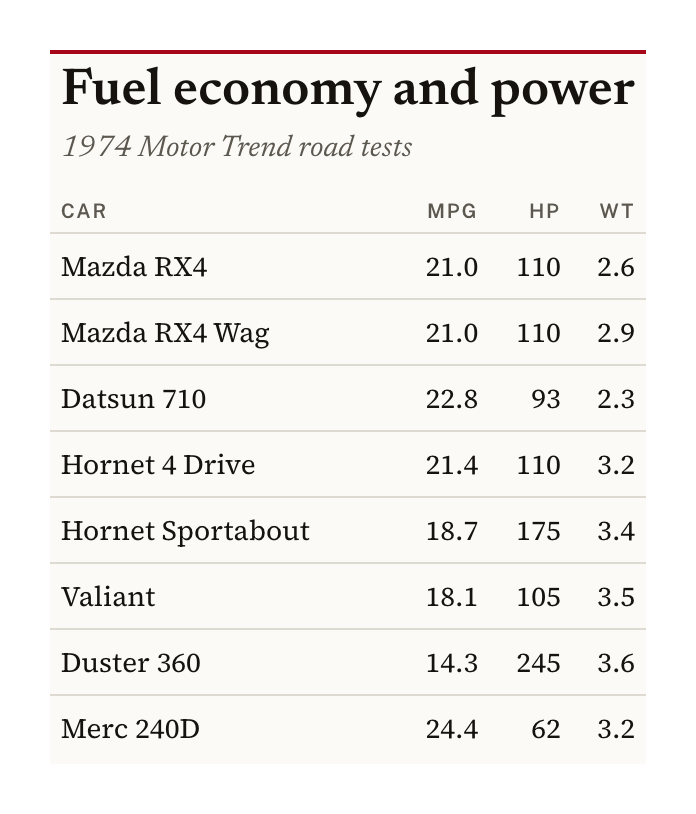
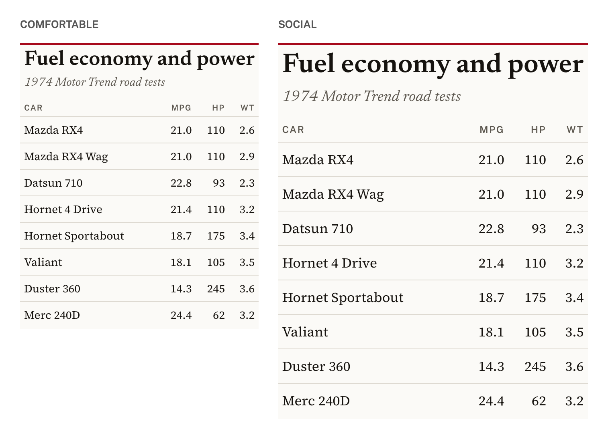
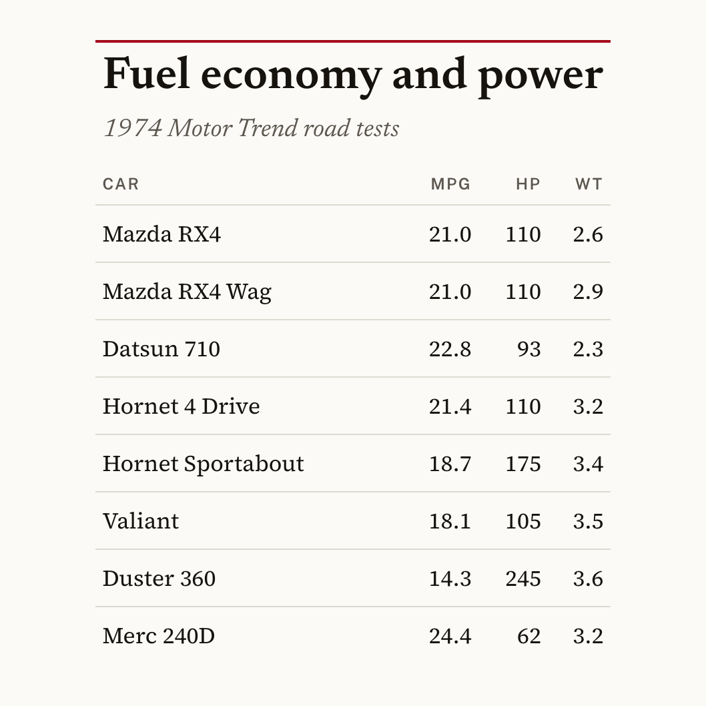
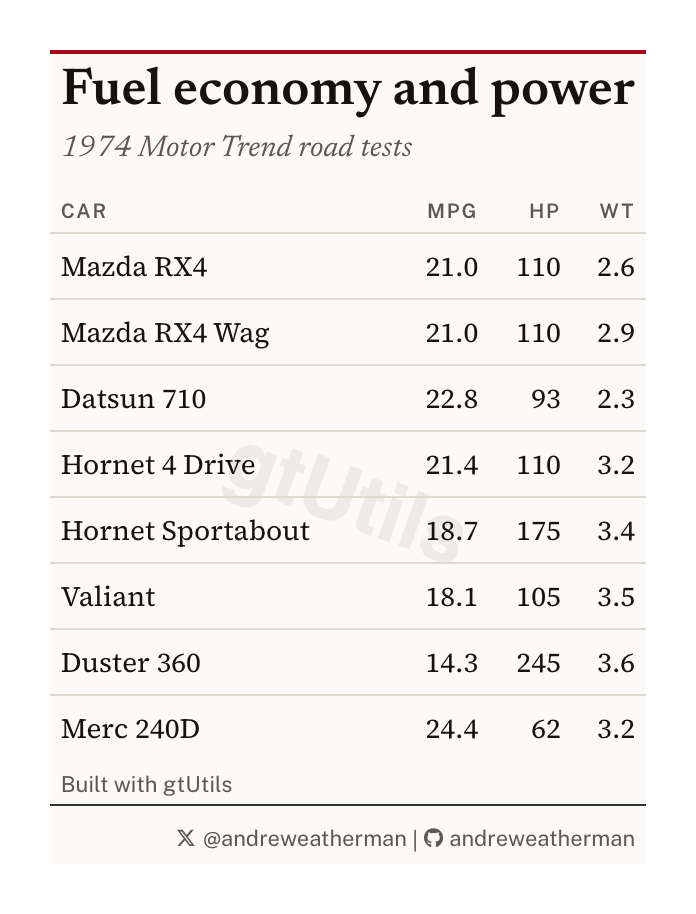
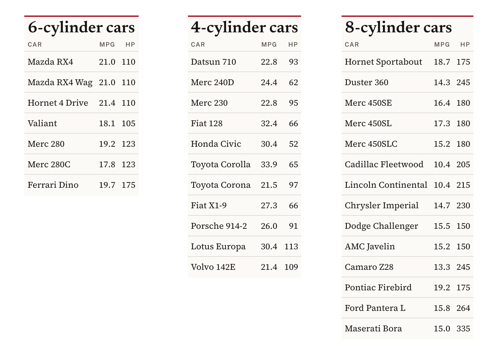

```{r, include = FALSE}
knitr::opts_chunk$set(
  collapse = TRUE,
  comment = "#>",
  message = FALSE,
  warning = FALSE,
  eval = FALSE
)
```

```{r setup, echo = FALSE}
library(gtUtils)
library(gt)
```

A table built for a browser and a table built for a feed are not the same object.
`gt::gtsave()` writes what the browser rendered, margins included, at whatever
size the page happened to be. Posting wants a trimmed image, a predictable width
across a set, and often a specific shape.

This vignette covers the export side of the package: `gt_save_crop()`,
`gt_social_crop()`, `gt_save_batch()`, the `"social"` density on every theme,
and the two attribution functions, `gt_watermark()` and `gt_social_tag()`.

Everything below runs on `mtcars`.

```{r}
cars <- head(mtcars, 8)
cars$car <- rownames(cars)
cars <- cars[c("car", "mpg", "hp", "wt")]

tbl <- gt(cars) %>%
  gt_theme_broadsheet() %>%
  tab_header("Fuel economy and power", "1974 Motor Trend road tests") %>%
  fmt_number(c(mpg, wt), decimals = 1)
```

## Trimming and padding

`gt_save_crop()` renders the table, trims the whitespace around it, then pads it
back by a fixed amount so the image has an even margin on all four sides.

```{r}
tbl %>% gt_save_crop(file = "table.png")
```

```{r, eval=TRUE, echo=FALSE, out.width="55%"}

```

`whitespace` sets that margin in pixels and `bg` sets its color, which should
match the theme's background. `zoom` controls the render scale, at `2` by
default, so the output is retina-sized.

`width` is the one to know about for a series. Passing it scales the finished
image to an exact pixel width, holding the aspect ratio. The table above comes
out 696 by 814. With `width = 900` it becomes 900 by 1053.

```{r}
tbl %>% gt_save_crop(file = "table.png", width = 900)
```

Leave `file` unset and the image is returned rather than written, which is useful
when you want to keep working on it with `magick`.

## Sizing type for an image

Type sized for a browser reads small once the image is scaled into a feed. Every
theme in the package takes a `density` argument, and `"social"` is the setting
built for this (17px body, roomier rows, and a larger title).

```{r}
gt(cars) %>% gt_theme_broadsheet(density = "social")
```

```{r, eval=TRUE, echo=FALSE}

```

## A fixed canvas

Some destinations want a shape rather than a size. `gt_social_crop()` centers the
table on a canvas of a target aspect ratio.

```{r}
gt(cars) %>%
  gt_theme_broadsheet(density = "social") %>%
  gt_social_crop(aspect_ratio = "1:1", bg = "#FBFAF7", file = "square.png")
```

```{r, eval=TRUE, echo=FALSE, out.width="60%"}

```

`aspect_ratio` reads `"1:1"`, `"16:9"`, `"4x5"`, or a bare number like `1.91`.

The canvas always grows to fit. The same table comes out 834 by 834 at `"1:1"`
and 1483 by 834 at `"16:9"`, so the height held and the width expanded. It works
that way in both directions, which means the table is never cropped to make the
ratio. `gravity` moves the table on the canvas if you do not want it centered.

## Attribution

`gt_watermark()` puts a faint wordmark behind the table body, and
`gt_social_tag()` puts handles and icons in the source note.

```{r}
tbl %>%
  gt_watermark(text = "gtUtils", opacity = 0.06, size = "62%", angle = 20,
               font = "Helvetica") %>%
  gt_social_tag(c(x = "@andreweatherman", gh = "andreweatherman"),
                caption = "Built with gtUtils") %>%
  gt_save_crop(file = "branded.png")
```

```{r, eval=TRUE, echo=FALSE, out.width="55%"}

```

Two things about the watermark.

It is drawn as an SVG background image, because that is the only way to sit
behind the body without taking up a row. An SVG background cannot load the page's
webfonts, so `font` has to name a face installed on the machine doing the
rendering. `"Helvetica"` and `"Arial"` are safe. A Google font named there will
silently fall back.

It also sits behind the body cells, so it disappears under any cell that has its
own fill. On a striped theme, or after `gt_color_ranks()`, you will only see it
in the gaps. Themes without fills, like `gt_theme_broadsheet()` or
`gt_theme_swiss()`, show it cleanly.

`gt_social_tag()` takes a named vector where the names pick the icon. It knows
the common aliases (`x`, `bsky`, `ig`, `gh`, `yt`, `web`, `email` among others)
and falls back to any Font Awesome icon name. `stack = TRUE` puts one account per
line for a narrow table.

## One image per group

`gt_save_batch()` splits the data, builds a table for each group with a function
you supply, and writes one image per group.

```{r}
bcars <- mtcars
bcars$car <- rownames(bcars)
bcars <- bcars[c("car", "cyl", "mpg", "hp")]

gt_save_batch(
  bcars,
  group = cyl,
  file = "cyl-{group}.png",
  dir = "out",
  fn = function(df, g) {
    gt(df[c("car", "mpg", "hp")]) %>%
      gt_theme_broadsheet() %>%
      tab_header(paste0(g, "-cylinder cars"))
  }
)
```

```{r, eval=TRUE, echo=FALSE}

```

`file` is a pattern rather than a path. `{group}` is replaced by each group's
value, so this writes `out/cyl-4.png`, `out/cyl-6.png`, and `out/cyl-8.png`. The
directory is created if it does not exist.

`fn` receives that group's rows and the group value, and has to return a
`gt_tbl`. Anything else raises an error naming what came back instead.

`match_width` is on by default and is the reason to use this over a loop. The
three groups here hold 11, 7, and 14 cars, so the tables render at different
widths. Every image is padded out to the widest of them, giving 524 pixels across
all three with heights of 680, 944, and 1142.

Set `match_width = FALSE` to keep each image at its natural width, and
`quiet = TRUE` to suppress the per-group progress messages.
