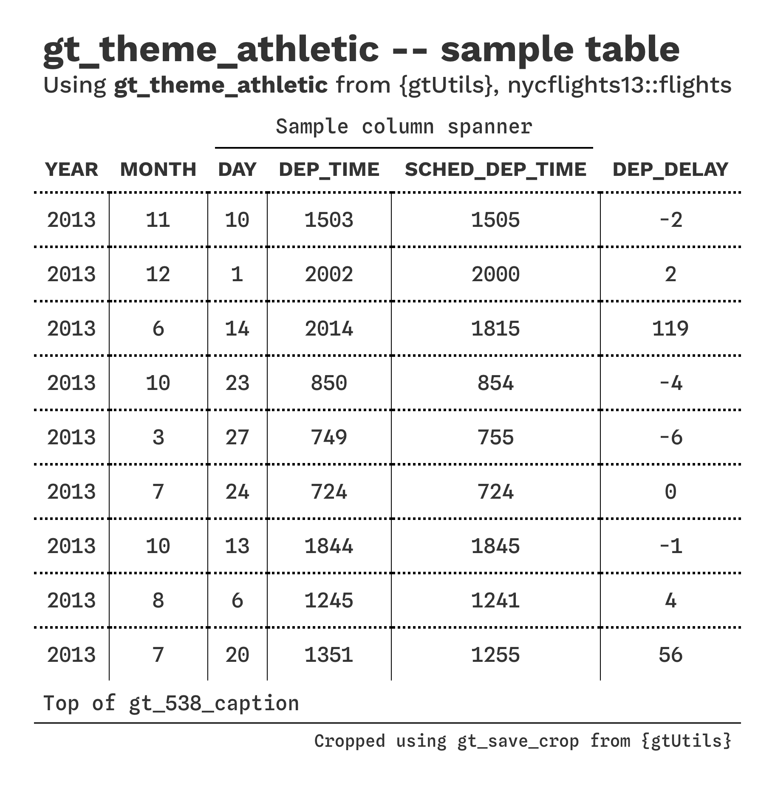
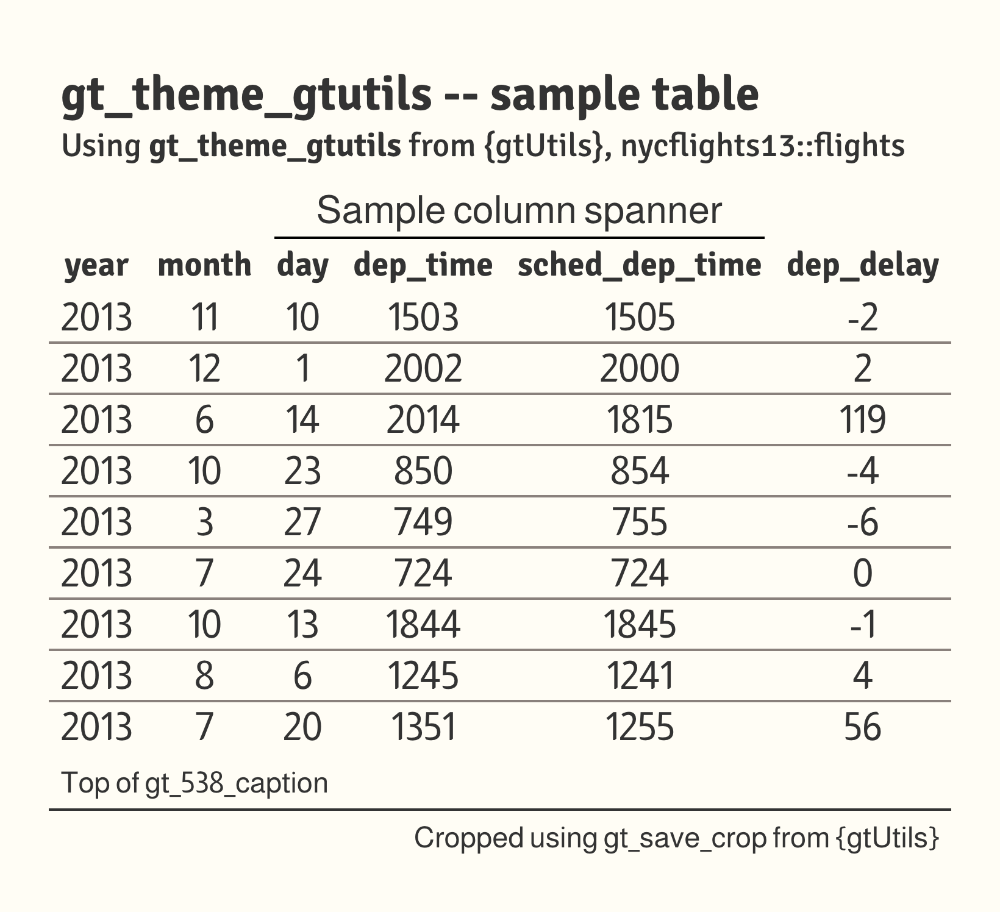
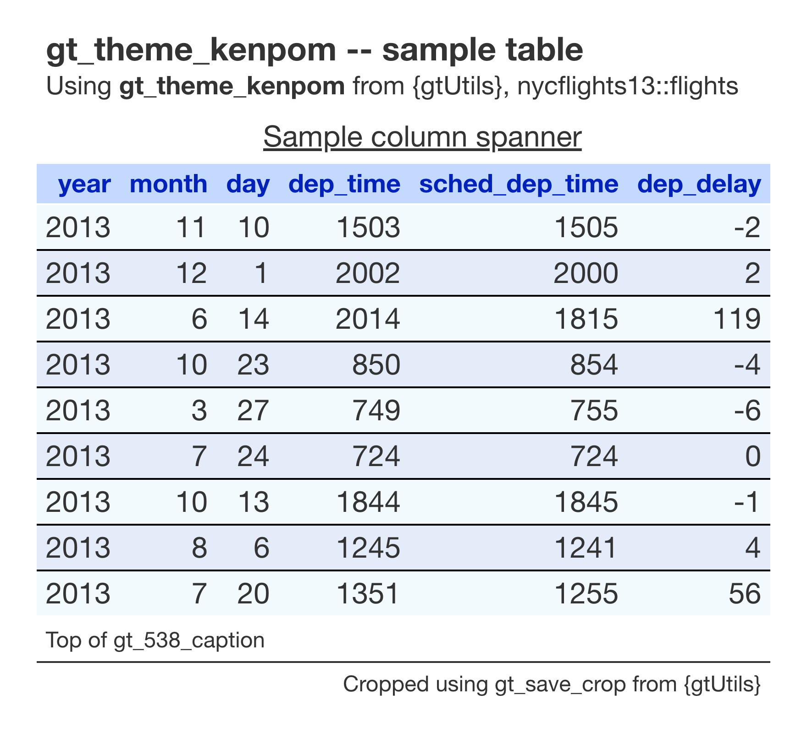
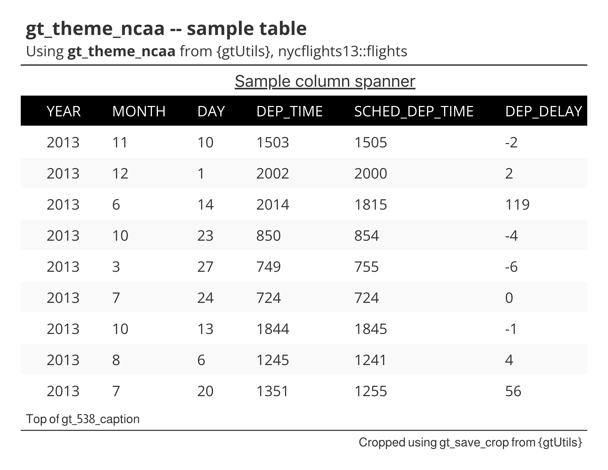
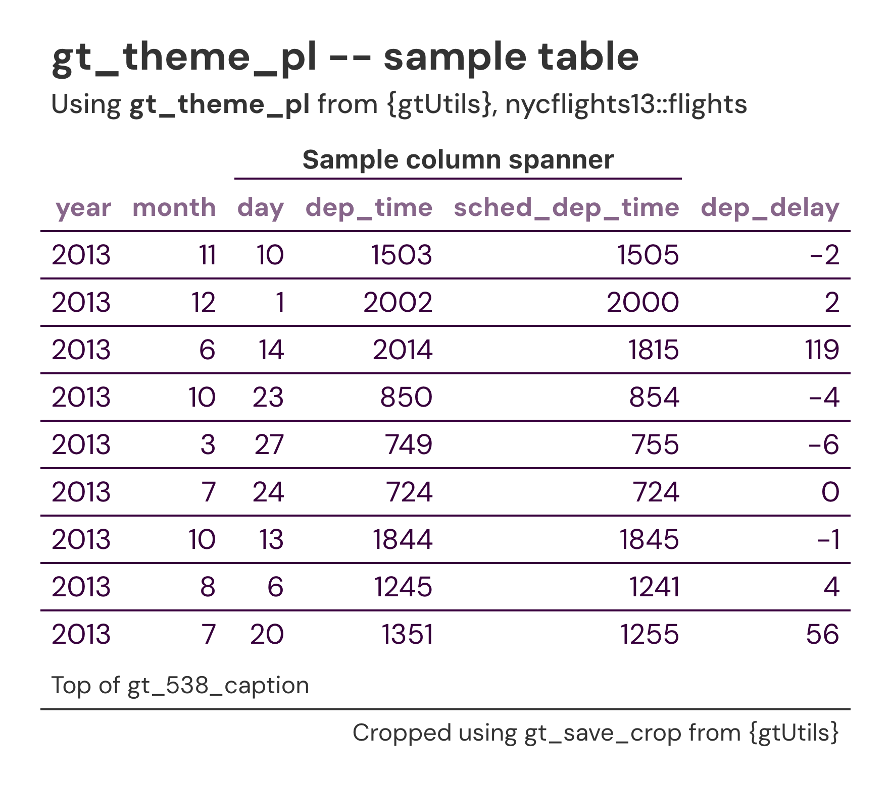
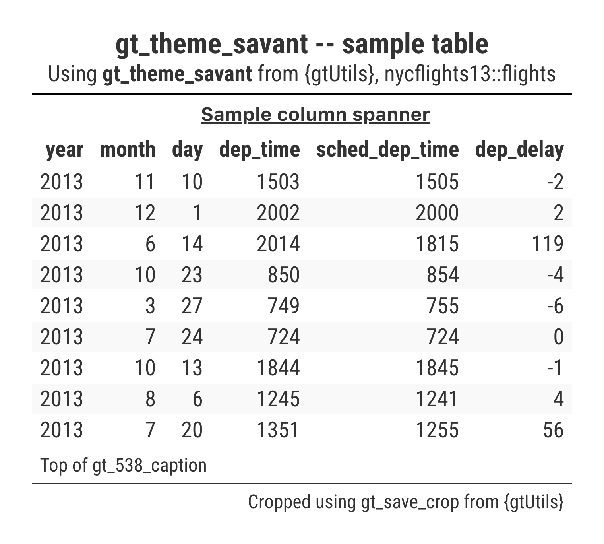
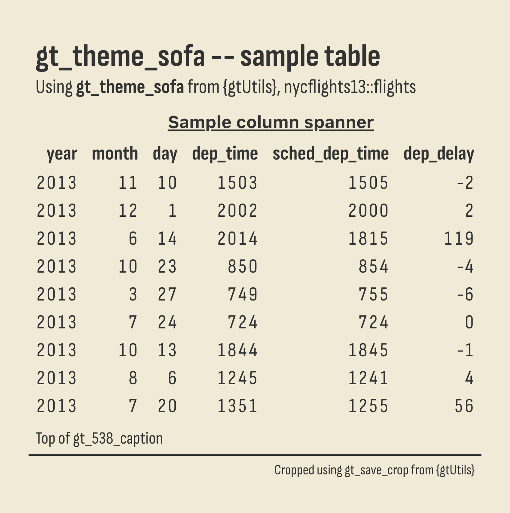
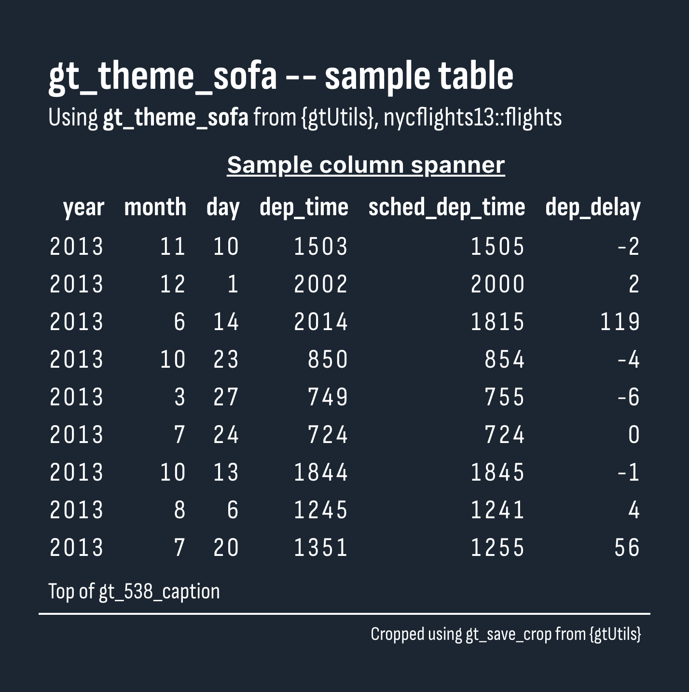
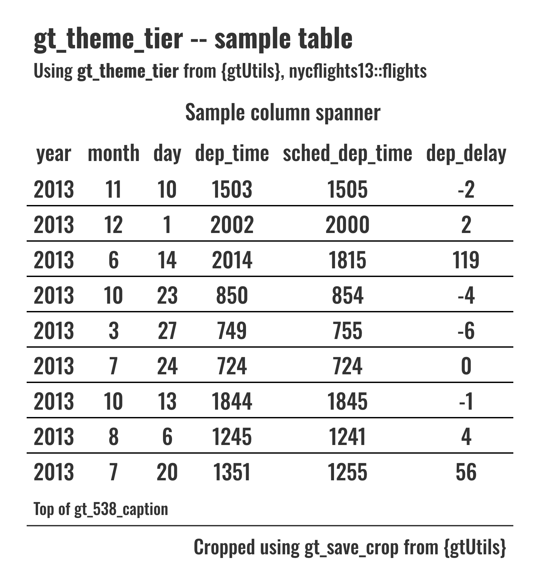
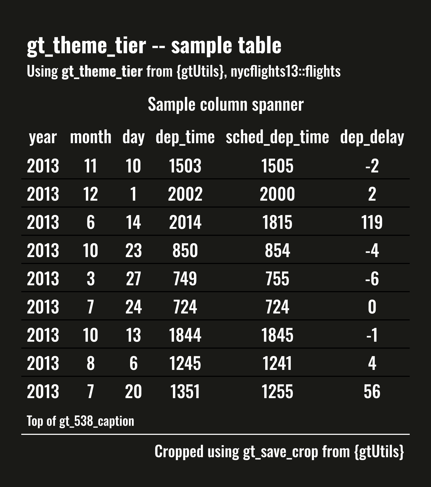

```{r, include = FALSE}
knitr::opts_chunk$set(
  collapse = TRUE,
  comment = "#>",
  message = FALSE,
  eval = FALSE
)
```

`gtUtils` v0.1 ships with eight table themes.

<details>
<summary>gt_theme_athletic</summary>
```{r, eval=TRUE, echo=FALSE}

```
</details>

<details>
<summary>gt_theme_gtutils</summary>
```{r, eval=TRUE, echo=FALSE}

```
</details>

<details>
<summary>gt_theme_kenpom</summary>
```{r, eval=TRUE, echo=FALSE}

```
</details>

<details>
<summary>gt_theme_ncaa</summary>
```{r, eval=TRUE, echo=FALSE}

```
</details>

<details>
<summary>gt_theme_pl</summary>
```{r, eval=TRUE, echo=FALSE}

```
</details>

<details>
<summary>gt_theme_savant</summary>
```{r, eval=TRUE, echo=FALSE}

```
</details>

<details>
<summary>gt_theme_sofa -- light mode</summary>
```{r, eval=TRUE, echo=FALSE}

```
</details>

<details>
<summary>gt_theme_sofa -- dark mode</summary>
```{r, eval=TRUE, echo=FALSE}

```
</details>

<details>
<summary>gt_theme_tier -- light mode</summary>
```{r, eval=TRUE, echo=FALSE}

```
</details>

<details>
<summary>gt_theme_tier -- dark mode</summary>
```{r, eval=TRUE, echo=FALSE}

```
</details>
