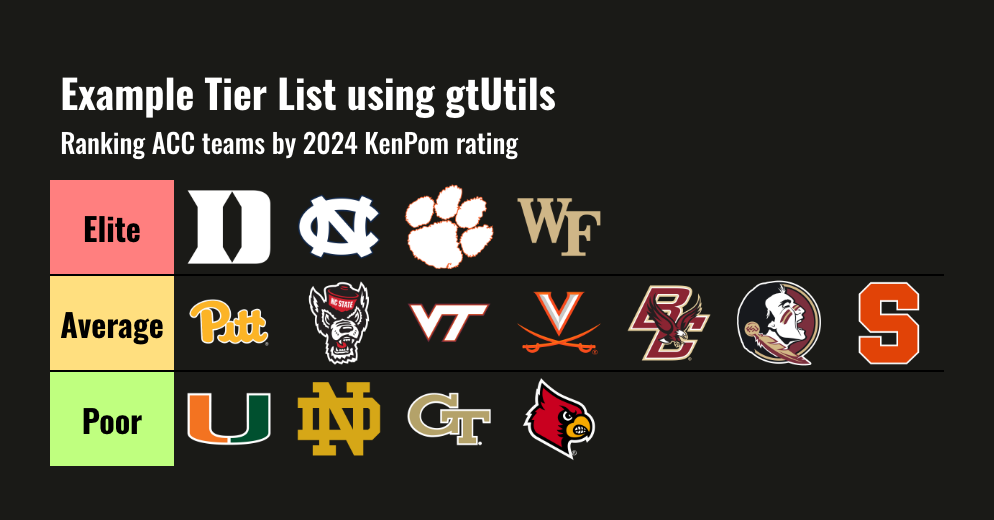

```{r, include = FALSE}
knitr::opts_chunk$set(
  collapse = TRUE,
  comment = "#>",
  message = FALSE,
  eval = FALSE,
  out.width = "75%",
  fig.align = "center"
)
```

```{r setup, message=FALSE, eval=FALSE}
library(gtUtils)
library(gt)
library(tidyverse)
library(cbbdata)
```

`gtUtils` ships with a function that makes creating tier lists convenient and quick. However, you need to pass your data to `gt` in a specific format. This vignette walks through how to create a simple tier list.

```{r, echo = FALSE, out.width="75%", eval=TRUE}

```

## Basic Tier List

For this example, we will be using data that is fetched from the [{cbbdata}](https://www.cbbdata.aweatherman.com/) package. For conveniance, that data will be pushed to a gist for easy extraction.

### Processing

If you're interested in how to pull the data from `cbbdata`:

```{r}
cbd_kenpom_ratings(year = 2024, conf = "ACC") %>% select(team, adj_em)
```

First, let's fetch the data form GitHub.

```{r, message=FALSE}
data <- read_csv("https://gist.github.com/andreweatherman/a8aaa6057e9858cd11c3327fc32df5bb/raw/3a54e221ae529dc8a2f37077770d7fb1b573b2c9/gtUtils_example_tier_list.csv")
```

We need to establish tiers and colors. For this example, we are going to use three distinct categories and use traditional tier list background colors.

```{r}
levels <- c("Elite", "Average", "Poor")
colors <- c("#FF7F7F", "#FFDF7F", "#BFFF7F")
```

Next, we need to bin our data into these tiers. `subset_rank` uses the `dense_rank` function to assign ordinal ranks based on our column of interest -- adjusted efficiency margin. Next, we use the cut function to divide these ranks into distinct tiers based on quantiles, specifying the breaks at the 25th and 75th percentiles. This means the data is split into three groups, with the lower 25% in one tier, the middle 50% in another, and the upper 25% in the final tier. The levels argument provides custom labels for each tier -- referencing the `levels` vector above -- while `include.lowest = TRUE` ensures the lowest rank is included in the first tier.

Finally, tier_order is calculated as the rank within each tier using `dense_rank` again, but this time grouped by the tier to ensure the ordering is relative to each group.

```{r}
data <- data %>% 
  mutate(subset_rank = dense_rank(-adj_em),
         tier = cut(subset_rank, 
                     breaks = quantile(subset_rank, probs = c(0, 0.25, 0.75, 1)), 
                     labels = levels, 
                     include.lowest = TRUE)) %>% 
  mutate(tier_order = dense_rank(subset_rank), .by = tier)
```

We can use `cbbdata` to grab team logos and join them onto our data. Importantly, we are going to use a dark table theme, so we need to grab the dark mode logos.

```{r}
data <- data %>% left_join(cbd_teams() %>% select(team = common_team, logo = espn_dark_logo))
```

Finally, we need to pivot our data to a *wide* format. This ensures that we will be plotting logos horizontally.

```{r}
data <- data %>% 
    pivot_wider(id_cols = tier, names_from = tier_order, values_from = logo) %>% 
    select(tier, sort(names(.))) %>% 
    arrange(tier)
```

Great -- if your data looks similar to this, you're ready to make a tier list!

```{r, echo = FALSE}
print(data)
```

### Plotting

`gt_tiers` does a few things under the hood:
-   It renders images from links
-   It applies the `gt_theme_tier` function using "dark" mode as a default
-   It forces all column labels to be blank

Let's apply it!

```{r, eval = FALSE}
data %>%
  gt() %>% 
  gt_tiers(levels, colors) %>% 
  tab_header(title = "Example Tier List using gtUtils", 
           subtitle = "Ranking ACC teams by 2024 KenPom rating")
```

```{r, echo = FALSE, out.width="75%", eval=TRUE}

```

All done! You've created a tier list in `gt` using `gtUtils`. As of `gtUtils` v0.1, the tier list function is somewhat limited: a) it only supports image cells and b) it will not "wrap" your logos to condense the width (you can play around with image_height to do this).

